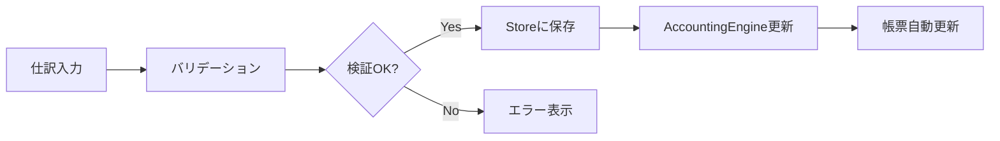

# データ体系整理ドキュメント

## 1. システム概要

本システムは、マンション管理組合の会計処理を総合的に支援するシステムです。
勘定科目、仕訳、区分、組合員などの基盤データを管理し、それらを基に各種帳票を自動生成します。

## 2. データアーキテクチャ

### 2.1 レイヤー構造

```
┌─────────────────────────────────────────────────────────┐
│                    プレゼンテーション層                    │
│                   (React Components)                      │
├─────────────────────────────────────────────────────────┤
│                      状態管理層                           │
│                    (Zustand Store)                       │
├─────────────────────────────────────────────────────────┤
│                     ビジネスロジック層                     │
│                  (Services & Engine)                     │
├─────────────────────────────────────────────────────────┤
│                      データアクセス層                      │
│                 (LocalStorage/IndexedDB)                 │
└─────────────────────────────────────────────────────────┘
```

## 3. 基盤データ構造

### 3.1 マスターデータ

#### 3.1.1 勘定科目マスター (AccountDefinition)

```typescript
interface AccountDefinition {
  code: string              // 勘定科目コード
  name: string              // 勘定科目名
  type: AccountType         // 科目区分（資産/負債/純資産/収益/費用）
  normalBalance: NormalBalance  // 通常残高（借方/貸方）
  level: number             // 階層レベル
  parentCode: string | null // 親科目コード
  division: DivisionCode    // 会計区分
  isActive?: boolean        // 有効フラグ
}
```

**用途**
- 仕訳入力時の科目選択
- 帳票での科目表示
- 階層的な集計処理

#### 3.1.2 組合員マスター (UnitOwnerDetail)

```typescript
interface UnitOwnerDetail {
  id: string
  unitNumber: string        // 部屋番号
  ownerInfo: {              // 所有者情報
    name: string
    nameKana?: string
    address?: string
    phone?: string
    email?: string
  }
  bankAccount?: {            // 銀行口座情報
    bankName: string
    branchName: string
    accountNumber: string
  }
  fees: {                    // 費用情報
    managementFee: number    // 管理費
    reserveFund: number      // 修繕積立金
    parkingFee?: number      // 駐車場代
  }
  status: {                  // ステータス
    isActive: boolean
    moveInDate?: string
    moveOutDate?: string
  }
}
```

**用途**
- 管理費・修繕積立金の請求管理
- 入金管理
- 滞納管理

#### 3.1.3 業者マスター (VendorDetail)

```typescript
interface VendorDetail {
  id: string
  vendorInfo: {              // 業者基本情報
    name: string
    registrationNumber?: string
    address?: string
    phone?: string
    email?: string
  }
  bankAccount?: {            // 振込先情報
    bankName: string
    branchName: string
    accountNumber: string
  }
  contractInfo: {            // 契約情報
    contractType: string
    serviceCategory: string
    paymentTerms?: string
  }
}
```

**用途**
- 支払管理
- 契約管理
- 発注管理

#### 3.1.4 会計区分マスター (Division)

```typescript
type DivisionCode = 'KANRI' | 'SHUZEN' | 'PARKING' | 'SPECIAL'

interface Division {
  code: DivisionCode
  name: string
  description?: string
}
```

**区分定義**
- **KANRI**: 管理会計（日常の管理運営）
- **SHUZEN**: 修繕会計（修繕積立金・大規模修繕）
- **PARKING**: 駐車場会計（駐車場運営）
- **SPECIAL**: 特別会計（その他特別目的）

### 3.2 トランザクションデータ

#### 3.2.1 統一仕訳データ (UnifiedJournal)

```typescript
interface UnifiedJournal {
  // 基本情報
  id: string
  journalNumber: string      // 仕訳番号
  date: string               // 取引日
  description: string        // 摘要
  division: DivisionCode     // 会計区分
  status: JournalStatus      // ステータス
  
  // 仕訳明細
  lines: JournalLine[]       // 明細行配列
  
  // 集計情報
  totalDebit: number         // 借方合計
  totalCredit: number        // 貸方合計
  isBalanced: boolean        // 貸借一致
  
  // メタデータ
  createdAt: string
  updatedAt: string
  createdBy?: string
}
```

#### 3.2.2 仕訳明細行 (JournalLine)

```typescript
interface JournalLine {
  id: string
  accountCode: string        // 勘定科目コード
  accountName: string        // 勘定科目名
  debitAmount: number        // 借方金額
  creditAmount: number       // 貸方金額
  description?: string       // 明細摘要
  auxiliaryCode?: string     // 補助科目コード
}
```

#### 3.2.3 銀行取引データ (BankTransaction)

```typescript
interface BankTransaction {
  id: string
  date: string
  description: string
  amount: number             // 正: 入金, 負: 出金
  balance?: number           // 残高
  matched?: boolean          // 照合済みフラグ
  journalId?: string         // 紐付け仕訳ID
}
```

### 3.3 補助データ

#### 3.3.1 自動仕訳ルール (AutoJournalRule)

```typescript
interface AutoJournalRule {
  id: string
  ruleName: string
  conditions: {              // 適用条件
    transactionType?: string
    amountRange?: { min?: number; max?: number }
    descriptionPatterns?: string[]
  }
  actions: {                 // 仕訳生成アクション
    debitAccount: string
    creditAccount: string
    division?: string
  }
  isActive: boolean
}
```

## 4. データフロー

### 4.1 基本的なデータフロー

```
[データ入力] → [検証] → [保存] → [集計] → [帳票出力]
     ↓           ↓        ↓        ↓          ↓
  手動入力    ルール    Store   Engine    各種報告書
  CSV取込    チェック   永続化   計算      PDF/Excel
  自動仕訳
```

### 4.2 仕訳処理フロー



### 4.3 銀行取引連携フロー


## 5. 帳票体系

### 5.1 基本帳票

| 帳票名 | 用途 | データソース | 出力形式 |
|--------|------|--------------|----------|
| 仕訳帳 | 全仕訳の時系列表示 | UnifiedJournal | 画面/PDF |
| 総勘定元帳 | 科目別取引明細 | Journal + Account | 画面/PDF |
| 試算表 | 全科目の残高一覧 | TrialBalance | 画面/Excel |
| 貸借対照表 | 財政状態表示 | BalanceSheet | 画面/PDF |
| 損益計算書 | 収支状況表示 | IncomeStatement | 画面/PDF |

### 5.2 管理組合特有帳票

| 帳票名 | 用途 | データソース | 出力形式 |
|--------|------|--------------|----------|
| 収支報告書 | 月次・年次収支報告 | Division別集計 | PDF |
| 区分別会計報告 | 管理/修繕別報告 | Division別仕訳 | PDF |
| 滞納一覧表 | 未収金管理 | UnitOwner + 入金 | Excel |
| 予算実績対比表 | 予算管理 | 予算 + 実績 | Excel |

### 5.3 補助帳票

| 帳票名 | 用途 | データソース | 出力形式 |
|--------|------|--------------|----------|
| 補助元帳 | 補助科目別明細 | AuxiliaryLedger | 画面 |
| 現金出納帳 | 現金管理 | 現金科目仕訳 | Excel |
| 預金出納帳 | 預金管理 | 預金科目仕訳 | Excel |
| 支払予定表 | 支払管理 | Vendor + 未払金 | 画面 |

## 6. サービス層の構成

### 6.1 コアサービス

```typescript
// 会計処理の中核エンジン
class AccountingEngine {
  // 仕訳処理
  postJournal(journal: UnifiedJournal): void
  
  // 集計処理
  getTrialBalance(): TrialBalance
  getBalanceSheet(): BalanceSheet
  getIncomeStatement(): IncomeStatement
  
  // 区分別処理
  getDivisionReport(division: DivisionCode): DivisionReport
}
```

### 6.2 個別サービス

| サービス名 | 責務 |
|------------|------|
| JournalService | 仕訳の作成・編集・削除 |
| AccountService | 勘定科目管理 |
| DivisionService | 区分会計管理 |
| AuxiliaryService | 補助科目管理 |
| BankAccountService | 銀行口座管理 |
| TransactionService | 取引管理 |
| ReportService | 帳票生成 |
| ImportExportService | データ入出力 |
| LLMJournalService | AI仕訳提案 |

## 7. データ整合性の保証

### 7.1 検証ルール

1. **仕訳の貸借一致**
   - 借方合計 = 貸方合計
   - 必須チェック

2. **勘定科目の存在確認**
   - 使用科目がマスターに存在
   - 有効フラグの確認

3. **日付の妥当性**
   - 会計期間内
   - 未来日付の制限

4. **ステータス管理**
   - DRAFT → POSTED → CANCELLED
   - 逆行不可

### 7.2 データ保護

1. **論理削除**
   - 物理削除は行わない
   - CANCELLEDステータスで管理

2. **監査証跡**
   - 作成日時・作成者
   - 更新日時・更新者
   - 変更履歴

3. **バックアップ**
   - 自動エクスポート
   - 世代管理

## 8. パフォーマンス最適化

### 8.1 データ取得

- **ページネーション**: 大量データの分割取得
- **遅延読み込み**: 必要時のみ詳細データ取得
- **キャッシング**: 頻繁アクセスデータのメモリ保持

### 8.2 集計処理

- **差分更新**: 変更分のみ再計算
- **メモ化**: 計算結果のキャッシュ
- **バッチ処理**: 大量処理の非同期実行

## 9. セキュリティ考慮事項

### 9.1 アクセス制御

- ユーザー権限管理（将来実装）
- 機能別アクセス制限
- データ範囲の制限

### 9.2 データ保護

- 入力値のサニタイズ
- XSS対策
- SQLインジェクション対策（将来DB実装時）

## 10. 拡張性の確保

### 10.1 プラグイン構造

- カスタム帳票の追加
- 外部システム連携
- カスタムルールの追加

### 10.2 API設計

- RESTful API（将来実装）
- GraphQL対応（検討中）
- Webhook連携

## 11. 実装ロードマップ

### Phase 1: 基本機能（完了）
- ✅ 基本的な仕訳入力
- ✅ 主要帳票の生成
- ✅ データの永続化

### Phase 2: 拡張機能（実装中）
- 🔄 銀行取引連携
- 🔄 自動仕訳ルール
- 🔄 補助科目対応

### Phase 3: 高度機能（計画中）
- ⏳ AI仕訳提案
- ⏳ 承認ワークフロー
- ⏳ 外部システム連携

### Phase 4: エンタープライズ機能（将来）
- ⏳ マルチテナント対応
- ⏳ 監査機能強化
- ⏳ BI/分析機能

## 12. 運用・保守

### 12.1 日次運用

1. データバックアップ
2. エラーログ確認
3. パフォーマンス監視

### 12.2 月次運用

1. データ整合性チェック
2. 不要データのクリーンアップ
3. パフォーマンスチューニング

### 12.3 年次運用

1. 年度更新処理
2. アーカイブ処理
3. マスターデータ見直し

## 13. トラブルシューティング

### 13.1 よくある問題と対処

| 問題 | 原因 | 対処方法 |
|------|------|----------|
| 仕訳が保存されない | 貸借不一致 | 金額を確認 |
| 帳票が表示されない | データ未登録 | 仕訳を確認 |
| 集計が合わない | 区分設定誤り | 区分を確認 |

### 13.2 データリカバリ

1. エクスポートデータから復元
2. LocalStorageから復旧
3. 手動再入力

## 14. 用語集

| 用語 | 説明 |
|------|------|
| 仕訳 | 取引を借方・貸方に分けて記録すること |
| 勘定科目 | 取引を分類するための項目 |
| 補助科目 | 勘定科目をさらに細分化した項目 |
| 貸借対照表 | ある時点の財政状態を表す表 |
| 損益計算書 | 一定期間の経営成績を表す表 |
| 試算表 | 全勘定科目の残高を一覧にした表 |

## 15. 参考資料

- [仕訳システムアーキテクチャ](./JOURNAL_ARCHITECTURE.md)
- [コード整理計画](./CODE_CLEANUP_PLAN.md)
- [改善計画](./improvement-plan.md)
- [TypeScript型定義](./src/types/)
- [サービス実装](./src/domain/services/)

---

*最終更新日: 2025-08-18*
*バージョン: 1.0.0*