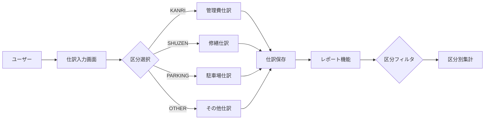

# Phase 10 実装詳細書

## 実装の背景と目的

### 背景
Phase 9の設計分析で、以下の問題が判明：
1. 仕訳データの区分が`KANRI`と`SHUZEN`の2つのみ
2. `PARKING`（駐車場）と`OTHER`（その他）が未実装
3. 勘定科目の区分（COMMON含む）と仕訳の区分が混同されていた

### 目的
- マンション管理組合会計に必要な4区分を完全実装
- 仕訳データに正しい区分を明示的に設定
- 区分別の正確な集計を実現

## アーキテクチャ設計

### 区分の階層構造
```
勘定科目マスタ（divisionCode）
├── COMMON（共通）
│   └── 複数区分で使用可能な勘定科目
├── KANRI（管理費会計専用）
├── SHUZEN（修繕積立金会計専用）
├── PARKING（駐車場会計専用）
└── OTHER（その他特別会計専用）

仕訳データ（division）
├── KANRI（管理費会計）
├── SHUZEN（修繕積立金会計）
├── PARKING（駐車場会計）
└── OTHER（その他特別会計）
※COMMONは存在しない
```

### データフロー


## 実装の詳細

### 1. 型システムの改善

#### 型定義の拡張
```typescript
// src/types/journal.ts
export type Division = 'KANRI' | 'SHUZEN' | 'PARKING' | 'OTHER'
```

**設計判断**:
- `COMMON`を除外：仕訳は必ず具体的な区分に属する
- 4区分で法的要件を満たす

### 2. UI層の改善

#### 会計区分選択UI
```jsx
<select value={division} onChange={handleDivisionChange}>
  <option value="KANRI">管理費会計</option>
  <option value="SHUZEN">修繕積立金会計</option>
  <option value="PARKING">駐車場会計</option>
  <option value="OTHER">その他特別会計</option>
</select>
```

**UXの考慮**:
- デフォルト値は`KANRI`（最も使用頻度が高い）
- 日本語ラベルで分かりやすく表示
- 必須項目として明示

### 3. ビジネスロジックの改善

#### レポート機能のフィルタリング
```typescript
// Before: 勘定科目の区分でフィルタ
if (!divisionCode || account.division === divisionCode || account.division === 'COMMON')

// After: 仕訳の区分でフィルタ
if (divisionCode && journal.division !== divisionCode) {
  continue
}
```

**改善効果**:
- 正確な区分別集計
- パフォーマンス向上（早期continue）
- ロジックの簡潔化

## バリデーションルール

### 仕訳作成時
1. **区分の必須チェック**
   - 空値は許可しない
   - COMMONは許可しない

2. **勘定科目の使用可否**
   ```typescript
   function canUseAccount(account, division) {
     return account.divisionCode === 'COMMON' || 
            account.divisionCode === division
   }
   ```

3. **区分間振替**
   - 振替元と振替先の区分が異なる場合も許可
   - ただし、明示的な区分指定が必要

## パフォーマンス最適化

### フィルタリングの最適化
```typescript
// 早期リターンによる最適化
if (divisionCode && journal.division !== divisionCode) {
  continue  // 不要な処理をスキップ
}
```

### インデックスの活用
- 仕訳データは日付でソート済み
- 区分でのグループ化を効率化

## テストシナリオ

### 単体テスト
```typescript
describe('Division', () => {
  it('4区分すべてを受け入れる', () => {
    const divisions: Division[] = ['KANRI', 'SHUZEN', 'PARKING', 'OTHER']
    expect(divisions).toHaveLength(4)
  })
  
  it('COMMONは仕訳区分として使用できない', () => {
    // @ts-expect-error
    const invalid: Division = 'COMMON'
  })
})
```

### 統合テスト
1. **仕訳入力**
   - 各区分で仕訳作成
   - 区分変更時の動作確認

2. **レポート表示**
   - 区分別フィルタリング
   - 集計の正確性

## 移行戦略

### 既存データの移行
```javascript
// 移行スクリプトの概要
function migrateJournals(journals) {
  return journals.map(journal => {
    // divisionがない場合は勘定科目から推測
    if (!journal.division) {
      journal.division = inferDivision(journal.details)
    }
    // PARKING、OTHERのデータは手動確認が必要
    return journal
  })
}
```

### 段階的移行
1. **Phase 1**: 型定義とUI（完了）
2. **Phase 2**: 既存データの移行
3. **Phase 3**: バリデーション強化
4. **Phase 4**: レポート機能の拡張

## セキュリティ考慮事項

### 入力検証
- SQLインジェクション対策（パラメータ化）
- XSS対策（エスケープ処理）
- 区分の妥当性チェック

### 権限管理
- 将来的に区分別のアクセス制御を検討
- 監査ログの記録

## 今後の拡張性

### 追加可能な機能
1. **区分別の予算管理**
2. **区分間振替の制限設定**
3. **区分別の承認ワークフロー**
4. **カスタム区分の追加**

### API設計
```typescript
interface DivisionAPI {
  // 区分一覧取得
  getDivisions(): Division[]
  
  // 区分別仕訳取得
  getJournalsByDivision(division: Division): Journal[]
  
  // 区分間振替
  transferBetweenDivisions(from: Division, to: Division, amount: number): Result
}
```

## まとめ

Phase 10では、会計区分の完全実装により：
1. **法的要件の充足**: 4区分の区分経理が可能に
2. **データの正確性**: 明示的な区分指定
3. **保守性の向上**: 明確な設計と実装

これにより、マンション管理組合の複雑な会計要件に対応できる基盤が整った。