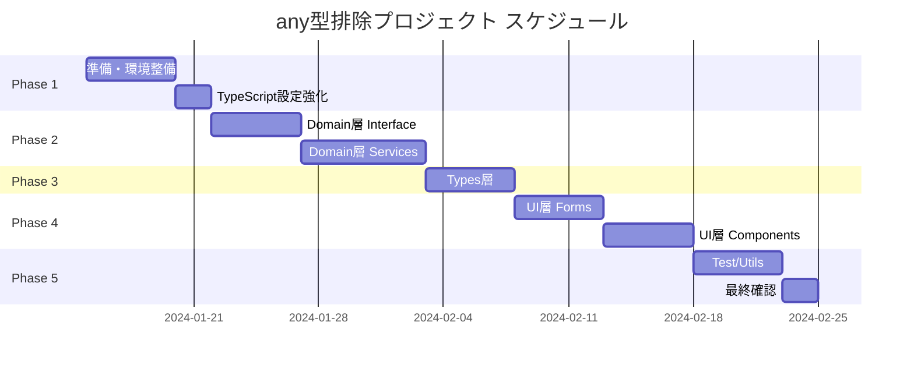

# any型排除 実装ロードマップ

## 実装スケジュール概要



## Week 1: 準備フェーズ

### 目標
- 開発環境の整備
- 型検証ツールの導入
- 基盤となる型定義の作成

### タスクリスト

#### 1.1 TypeScript設定の更新
```json
// tsconfig.json
{
  "compilerOptions": {
    "strict": true,
    "noImplicitAny": true,
    "strictNullChecks": true,
    "strictFunctionTypes": true,
    "noUnusedLocals": true,
    "noUnusedParameters": true,
    "noImplicitReturns": true,
    "noFallthroughCasesInSwitch": true
  }
}
```

#### 1.2 必要なパッケージのインストール
```bash
npm install --save zod
npm install --save-dev @types/node
```

#### 1.3 基本型定義の作成
```typescript
// src/types/core.ts
export type Result<T, E = Error> = 
  | { ok: true; value: T }
  | { ok: false; error: E };

export type Nullable<T> = T | null;
export type Optional<T> = T | undefined;
export type Maybe<T> = T | null | undefined;

// 型ガードユーティリティ
export const isNotNull = <T>(value: T | null): value is T => value !== null;
export const isNotUndefined = <T>(value: T | undefined): value is T => value !== undefined;
export const isDefined = <T>(value: T | null | undefined): value is T => 
  value !== null && value !== undefined;
```

## Week 2-3: Domain層の改善

### 対象ファイル一覧

| ファイル | any使用数 | 優先度 | 推定工数 |
|---------|-----------|--------|----------|
| IJournalService.ts | 2 | High | 2h |
| IAccountService.ts | 2 | High | 2h |
| JournalService.ts | 2 | High | 4h |
| AccountService.ts | 2 | High | 4h |
| MockJournalService.ts | 9 | Medium | 3h |
| ImportExportService.ts | 3 | Medium | 2h |
| adapters.ts | 14 | Low | 4h |

### 改善例: IJournalService.ts

```typescript
// Before
interface IJournalService {
  createJournal(data: any): any;
  updateJournal(id: string, data: any): boolean;
}

// After
import { z } from 'zod';
import { Result } from '@/types/core';

// 入力データのスキーマ定義
export const CreateJournalInputSchema = z.object({
  date: z.string().regex(/^\d{4}-\d{2}-\d{2}$/),
  description: z.string().min(1).max(200),
  division: z.string(),
  details: z.array(z.object({
    accountCode: z.string(),
    debitAmount: z.number().nullable(),
    creditAmount: z.number().nullable(),
    description: z.string().optional()
  })).min(2) // 最低2行の明細が必要
});

export type CreateJournalInput = z.infer<typeof CreateJournalInputSchema>;

export const UpdateJournalInputSchema = CreateJournalInputSchema.partial();
export type UpdateJournalInput = z.infer<typeof UpdateJournalInputSchema>;

interface IJournalService {
  createJournal(data: CreateJournalInput): Result<Journal>;
  updateJournal(id: string, data: UpdateJournalInput): Result<Journal>;
}
```

## Week 4: Types層の改善

### 対象ファイル一覧

| ファイル | any使用数 | 優先度 | 推定工数 |
|---------|-----------|--------|----------|
| services.ts | 2 | High | 2h |
| transaction.ts | 1 | High | 1h |
| accounting.ts | 5 | High | 3h |
| payment.ts | 4 | Medium | 2h |
| ui.ts | 3 | Low | 2h |

### 改善例: transaction.ts

```typescript
// Before
export interface Transaction {
  id: string;
  data: any;
  metadata?: any;
}

// After
export interface TransactionDetail {
  accountCode: string;
  accountName: string;
  debitAmount: number | null;
  creditAmount: number | null;
  description?: string;
  taxInfo?: TaxInformation;
}

export interface TransactionMetadata {
  createdBy: string;
  createdAt: string;
  updatedBy?: string;
  updatedAt?: string;
  source: 'manual' | 'import' | 'api';
  importBatch?: string;
}

export interface Transaction {
  id: string;
  date: string;
  description: string;
  division: string;
  details: TransactionDetail[];
  metadata: TransactionMetadata;
  status: 'draft' | 'pending' | 'posted' | 'cancelled';
}
```

## Week 5-6: UI層の改善

### 対象コンポーネント（Priority High）

| コンポーネント | any使用数 | 複雑度 | 推定工数 |
|---------------|-----------|--------|----------|
| UnifiedJournalForm.tsx | 1 | High | 4h |
| FreeeStyleJournalForm.tsx | 2 | High | 4h |
| BankImportWizard.tsx | 5 | High | 6h |
| LedgerView.tsx | 5 | Medium | 3h |
| ChartOfAccountsPanel.tsx | 6 | Medium | 4h |

### 改善例: フォーム入力の型安全化

```typescript
// Before
const handleSubmit = (formData: any) => {
  dispatch(createJournal(formData));
};

// After
import { z } from 'zod';
import { useForm } from 'react-hook-form';
import { zodResolver } from '@hookform/resolvers/zod';

const JournalFormSchema = z.object({
  date: z.string().regex(/^\d{4}-\d{2}-\d{2}$/),
  description: z.string().min(1, "説明は必須です"),
  division: z.string().min(1, "区分を選択してください"),
  details: z.array(z.object({
    accountCode: z.string(),
    debitAmount: z.number().nullable(),
    creditAmount: z.number().nullable()
  })).refine(
    (details) => {
      const totalDebit = details.reduce((sum, d) => sum + (d.debitAmount || 0), 0);
      const totalCredit = details.reduce((sum, d) => sum + (d.creditAmount || 0), 0);
      return Math.abs(totalDebit - totalCredit) < 0.01;
    },
    { message: "貸借が一致しません" }
  )
});

type JournalFormData = z.infer<typeof JournalFormSchema>;

const JournalForm: React.FC = () => {
  const { register, handleSubmit, formState: { errors } } = useForm<JournalFormData>({
    resolver: zodResolver(JournalFormSchema)
  });

  const onSubmit = (data: JournalFormData) => {
    // 型安全なデータ処理
    dispatch(createJournal(data));
  };

  return (
    <form onSubmit={handleSubmit(onSubmit)}>
      {/* フォームフィールド */}
    </form>
  );
};
```

## Week 7: テスト・ユーティリティ

### 対象ファイル

| ファイル | any使用数 | 優先度 | 推定工数 |
|---------|-----------|--------|----------|
| errorHandler.ts | 3 | High | 2h |
| fileParser.ts | 5 | Medium | 3h |
| MockAccountService.ts | 2 | Low | 2h |
| smoke.test.ts | 1 | Low | 1h |

### 改善例: errorHandler.ts

```typescript
// Before
export function handleError(error: any): string {
  return error.message || 'Unknown error';
}

// After
export class AppError extends Error {
  constructor(
    message: string,
    public readonly code: string,
    public readonly statusCode: number = 500,
    public readonly details?: unknown
  ) {
    super(message);
    this.name = 'AppError';
    Object.setPrototypeOf(this, AppError.prototype);
  }
}

export function isAppError(error: unknown): error is AppError {
  return error instanceof AppError;
}

export function isError(error: unknown): error is Error {
  return error instanceof Error;
}

export function handleError(error: unknown): string {
  if (isAppError(error)) {
    console.error(`[${error.code}] ${error.message}`, error.details);
    return error.message;
  }
  
  if (isError(error)) {
    console.error(error.message, error.stack);
    return error.message;
  }
  
  if (typeof error === 'string') {
    console.error(error);
    return error;
  }
  
  console.error('Unknown error:', error);
  return 'An unexpected error occurred';
}
```

## 進捗トラッキング

### 週次チェックリスト

#### Week 1
- [ ] tsconfig.json更新
- [ ] zod導入
- [ ] core.ts作成
- [ ] 型ガードユーティリティ作成

#### Week 2
- [ ] IJournalService.ts改善
- [ ] IAccountService.ts改善
- [ ] IDivisionService.ts改善

#### Week 3
- [ ] JournalService.ts改善
- [ ] AccountService.ts改善
- [ ] ReportService.ts改善

#### Week 4
- [ ] services.ts改善
- [ ] transaction.ts改善
- [ ] accounting.ts改善

#### Week 5
- [ ] UnifiedJournalForm.tsx改善
- [ ] FreeeStyleJournalForm.tsx改善
- [ ] BankImportWizard.tsx改善

#### Week 6
- [ ] LedgerView.tsx改善
- [ ] ChartOfAccountsPanel.tsx改善
- [ ] 残りのUIコンポーネント改善

#### Week 7
- [ ] errorHandler.ts改善
- [ ] fileParser.ts改善
- [ ] テストコード改善
- [ ] 最終確認

## メトリクス計測スクリプト

```bash
#!/bin/bash
# check-any-usage.sh

echo "=== any型使用状況レポート ==="
echo "日付: $(date '+%Y-%m-%d %H:%M:%S')"
echo ""

echo "## TypeScriptファイル (.ts)"
echo "ファイル数: $(find src -name "*.ts" | wc -l)"
echo "any使用箇所: $(grep -h "any" src/**/*.ts 2>/dev/null | wc -l)"
echo ""

echo "## TypeScript Reactファイル (.tsx)"
echo "ファイル数: $(find src -name "*.tsx" | wc -l)"
echo "any使用箇所: $(grep -h "any" src/**/*.tsx 2>/dev/null | wc -l)"
echo ""

echo "## 詳細（ファイル別）"
echo "### 使用数が多いファイル TOP 10"
grep -c "any" src/**/*.{ts,tsx} 2>/dev/null | sort -t: -k2 -rn | head -10

echo ""
echo "## TypeScriptコンパイルエラー"
npx tsc --noEmit 2>&1 | grep error | wc -l
```

## リスク管理

### 想定されるリスクと対策

| リスク | 影響度 | 発生確率 | 対策 |
|--------|--------|----------|------|
| 既存機能の破壊 | High | Medium | - featureブランチで作業<br>- 包括的なテスト実施<br>- 段階的なマージ |
| 工数超過 | Medium | High | - バッファを20%確保<br>- 優先度による調整<br>- ペアプロの活用 |
| チーム習熟度不足 | Medium | Medium | - 勉強会の実施<br>- コードレビュー強化<br>- サンプルコード提供 |
| パフォーマンス低下 | Low | Low | - 型検証の最適化<br>- 開発時のみ有効化<br>- プロファイリング実施 |

## 成功の定義

### 定量的指標
- any型使用箇所: 200箇所 → 20箇所以下（90%削減）
- TypeScriptエラー: 0件
- テストカバレッジ: 80%以上維持

### 定性的指標
- 開発者体験の向上
- バグ発生率の低下
- コードレビュー時間の短縮
- 新規開発速度の向上

## 次のステップ

1. このロードマップのレビューと承認
2. チームへの説明会実施
3. Week 1タスクの開始
4. 週次進捗会議の設定