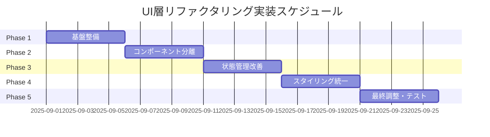

# UI層リファクタリング実装計画

## 1. 実装概要

### 1.1 プロジェクトタイムライン

**全体期間**: 2025年9月1日 〜 2025年10月4日（5週間）



### 1.2 チーム体制

| 役割 | 人数 | 責任範囲 |
|-----|------|---------|
| テックリード | 1名 | 設計レビュー、技術的決定 |
| フロントエンド開発者 | 2名 | 実装、テスト作成 |
| QAエンジニア | 1名 | テスト設計、品質保証 |
| プロダクトオーナー | 1名 | 要件確認、受け入れテスト |

## 2. Phase 1: 基盤整備（Week 1: 9/1-9/6）

### 2.1 目標
- 新しいディレクトリ構造の確立
- 共通コンポーネントの基盤作成
- 開発環境の整備

### 2.2 実装タスク

#### Task 1.1: ディレクトリ構造の作成（4h）

```bash
# 実行スクリプト
mkdir -p src/ui/layouts/{MainLayout,components/{Sidebar,Header,Footer}}
mkdir -p src/ui/components/{common,feedback,data-display}
mkdir -p src/ui/features/{journal,ledger,statement,payment}
mkdir -p src/ui/{hooks,contexts,styles,utils}
```

**成果物**:
- [ ] 新ディレクトリ構造
- [ ] 各ディレクトリのindex.tsファイル
- [ ] tsconfig.jsonのパスエイリアス設定

#### Task 1.2: 基本型定義の作成（8h）

```typescript
// src/ui/types/index.ts
export interface BaseComponentProps {
  className?: string;
  testId?: string;
}

export interface FormFieldProps<T = string> {
  name: string;
  value: T;
  onChange: (value: T) => void;
  error?: string;
  disabled?: boolean;
}

export type Variant = 'primary' | 'secondary' | 'danger' | 'success';
export type Size = 'small' | 'medium' | 'large';
```

#### Task 1.3: Context APIの基盤作成（8h）

```typescript
// src/ui/contexts/AccountingContext.tsx
// 基本的なContext構造の実装
```

**検証項目**:
- [ ] TypeScript エラーがないこと
- [ ] 既存コードとの互換性

### 2.3 リスクと対策

| リスク | 影響度 | 対策 |
|--------|--------|------|
| 既存コードとの競合 | 中 | 段階的な移行、互換性レイヤー |
| パス解決の問題 | 低 | webpack設定の調整 |

## 3. Phase 2: コンポーネント分離（Week 2: 9/9-9/13）

### 3.1 目標
- AppWithSidebar.tsxの分解
- 共通コンポーネントの実装
- レイアウトシステムの確立

### 3.2 実装タスク

#### Task 2.1: AppWithSidebar.tsxの分解（16h）

**Step 1: Sidebarコンポーネントの抽出**
```typescript
// src/ui/layouts/components/Sidebar/Sidebar.tsx
export const Sidebar: React.FC<SidebarProps> = ({ ... }) => {
  // 既存のサイドバーロジックを移植
};
```

**Step 2: MainLayoutの作成**
```typescript
// src/ui/layouts/MainLayout/MainLayout.tsx
export const MainLayout: React.FC<MainLayoutProps> = ({ ... }) => {
  // レイアウトロジックの実装
};
```

**Step 3: ルーティングロジックの分離**
```typescript
// src/ui/Router.tsx
export const Router: React.FC = () => {
  // ルーティングロジックの実装
};
```

#### Task 2.2: 共通コンポーネントの実装（12h）

**優先度順実装リスト**:
1. Button（2h）
2. Input（2h）
3. Select（2h）
4. Modal（3h）
5. Toast（3h）

#### Task 2.3: 既存コンポーネントの移行（8h）

**移行対象**:
- ConfirmDialog → Modal
- ToastNotification → Toast
- ThemeSwitcher → 新構造へ

### 3.3 検証計画

```typescript
// テストケース例
describe('Sidebar Component', () => {
  it('should toggle open/close state', () => {
    // テスト実装
  });
  
  it('should highlight active menu item', () => {
    // テスト実装
  });
});
```

## 4. Phase 3: 状態管理改善（Week 3: 9/16-9/20）

### 4.1 目標
- プロップドリリングの解消
- Context APIの全面導入
- カスタムフックの整備

### 4.2 実装タスク

#### Task 3.1: AccountingContextの完全実装（12h）

```typescript
// 実装項目
- [ ] 状態の定義
- [ ] Reducerの実装
- [ ] Actionsの定義
- [ ] カスタムフックの作成
```

#### Task 3.2: フォーム状態管理の統一（8h）

```typescript
// src/ui/hooks/useForm.ts
export const useForm = <T>(...) => {
  // 汎用フォームフックの実装
};
```

#### Task 3.3: 既存コンポーネントの接続（12h）

**移行順序**:
1. JournalForm（エンジン直接参照 → Context使用）
2. LedgerView（プロップス → Context使用）
3. StatementComponents（プロップス → Context使用）

### 4.3 パフォーマンス測定

```javascript
// 測定スクリプト
const measureRenderTime = () => {
  const start = performance.now();
  // レンダリング
  const end = performance.now();
  console.log(`Render time: ${end - start}ms`);
};
```

## 5. Phase 4: スタイリング統一（Week 4: 9/23-9/27）

### 5.1 目標
- CSS Modulesへの完全移行
- デザイントークンの確立
- レスポンシブ対応の改善

### 5.2 実装タスク

#### Task 4.1: CSS変数システムの構築（8h）

```css
/* src/ui/styles/tokens.css */
:root {
  /* Design Tokens */
  --token-color-primary: #3498db;
  --token-spacing-unit: 8px;
  /* ... */
}
```

#### Task 4.2: インラインスタイルの除去（16h）

**対象ファイル数**: 約25ファイル

**移行手順**:
1. インラインスタイルの抽出
2. CSS Moduleファイルの作成
3. クラス名の適用
4. 動的スタイルの処理

#### Task 4.3: レスポンシブシステムの実装（8h）

```typescript
// src/ui/hooks/useResponsive.ts
export const useResponsive = () => {
  const isMobile = useMediaQuery('(max-width: 768px)');
  const isTablet = useMediaQuery('(max-width: 1024px)');
  // ...
};
```

### 5.3 ビジュアルリグレッションテスト

```javascript
// Storybookでのビジュアルテスト
npm run test:visual
```

## 6. Phase 5: 最終調整・テスト（Week 5: 9/30-10/4）

### 6.1 目標
- 全機能の動作確認
- パフォーマンス最適化
- ドキュメント整備

### 6.2 実装タスク

#### Task 5.1: 統合テスト（16h）

**テストシナリオ**:
1. 仕訳入力フロー
2. 帳票表示フロー
3. データエクスポートフロー
4. 設定変更フロー

#### Task 5.2: パフォーマンス最適化（8h）

```typescript
// 最適化項目
- [ ] コード分割の実装
- [ ] 遅延読み込みの設定
- [ ] メモ化の適用
- [ ] バンドルサイズの削減
```

#### Task 5.3: ドキュメント作成（8h）

**作成ドキュメント**:
- コンポーネントカタログ
- 移行ガイド
- APIドキュメント
- スタイルガイド

### 6.3 受け入れ基準

| 項目 | 基準 | 測定方法 |
|-----|------|---------|
| 機能の完全性 | 100%の機能が動作 | E2Eテスト |
| パフォーマンス | FCP < 1.5s | Lighthouse |
| コード品質 | 0 ESLintエラー | ESLint |
| テストカバレッジ | > 80% | Jest Coverage |

## 7. リスク管理計画

### 7.1 リスクマトリクス

```
        高影響度
          ↑
    ┌─────────┬─────────┐
    │リスク1   │リスク2   │
    │機能破壊  │工数超過  │
高確 ├─────────┼─────────┤
率   │リスク3   │リスク4   │
←→  │互換性   │性能劣化  │
低確 └─────────┴─────────┘
率        ↓
        低影響度
```

### 7.2 リスク対応策

| リスク | 発生確率 | 影響度 | 対応策 | 責任者 |
|--------|---------|--------|--------|--------|
| 既存機能の破壊 | 中 | 高 | 段階的移行、自動テスト | テックリード |
| 工数超過 | 中 | 中 | バッファ確保、スコープ調整 | PM |
| 互換性問題 | 低 | 中 | 互換性レイヤー、段階的廃止 | 開発者 |
| パフォーマンス劣化 | 低 | 低 | 継続的測定、最適化 | 開発者 |

## 8. コミュニケーション計画

### 8.1 定例会議

| 会議名 | 頻度 | 参加者 | 目的 |
|--------|------|--------|------|
| デイリースタンドアップ | 毎日 | 開発チーム | 進捗共有、ブロッカー解決 |
| 週次レビュー | 週1回 | 全員 | 成果確認、次週計画 |
| 技術レビュー | 隔週 | 開発チーム | 設計レビュー、知識共有 |

### 8.2 ドキュメント管理

```
docs/17th/
├── daily/           # デイリーレポート
├── weekly/          # 週次レポート
├── phase-reports/   # フェーズ完了レポート
└── decisions/       # 技術的決定記録
```

## 9. 成功指標

### 9.1 定量的指標

| KPI | 現在値 | 目標値 | 測定時期 |
|-----|--------|--------|---------|
| コンポーネント数 | 33 | 50+ | Phase 2完了時 |
| 平均コンポーネント行数 | 180行 | <100行 | Phase 2完了時 |
| プロップドリリング箇所 | 30+ | <5 | Phase 3完了時 |
| CSSファイル数 | 7 | 統一 | Phase 4完了時 |
| バンドルサイズ | 800KB | 600KB | Phase 5完了時 |

### 9.2 定性的指標

- 開発者満足度の向上
- コードレビュー時間の短縮
- 新機能追加の容易性向上
- バグ報告数の減少

## 10. 段階的ロールアウト計画

### 10.1 カナリアリリース

```typescript
// Feature Flag による段階的有効化
const FEATURES = {
  NEW_LAYOUT: process.env.REACT_APP_NEW_LAYOUT === 'true',
  NEW_FORMS: process.env.REACT_APP_NEW_FORMS === 'true',
  // ...
};

// 使用例
{FEATURES.NEW_LAYOUT ? <NewLayout /> : <LegacyLayout />}
```

### 10.2 ロールバック計画

**ロールバック条件**:
- クリティカルバグの発見
- パフォーマンス基準未達
- ユーザーからの重大な問題報告

**ロールバック手順**:
1. Feature Flagの無効化
2. 前バージョンへのデプロイ
3. 問題の分析と修正
4. 再デプロイ計画の策定

## 11. 予算と工数見積もり

### 11.1 工数内訳

| Phase | 開発工数 | テスト工数 | レビュー工数 | 合計 |
|-------|---------|-----------|------------|------|
| Phase 1 | 32h | 8h | 4h | 44h |
| Phase 2 | 36h | 12h | 6h | 54h |
| Phase 3 | 32h | 10h | 5h | 47h |
| Phase 4 | 32h | 8h | 4h | 44h |
| Phase 5 | 32h | 16h | 8h | 56h |
| **合計** | **164h** | **54h** | **27h** | **245h** |

### 11.2 バッファ考慮

- 計画工数: 245h
- バッファ（20%）: 49h
- **総工数見積もり: 294h**

## 12. 次のステップ

### 12.1 即座に実施すべきアクション

1. **プロジェクトキックオフミーティング**
   - 日時: 2025年8月30日
   - 参加者: 全ステークホルダー
   - アジェンダ: 計画承認、役割分担

2. **開発環境の準備**
   - Storybookのセットアップ
   - テスト環境の構築
   - CI/CDパイプラインの調整

3. **初期タスクの作成**
   - Jiraチケットの作成
   - 担当者のアサイン
   - 期限の設定

### 12.2 継続的改善

**月次レトロスペクティブ**:
- 実施内容の振り返り
- 改善点の特定
- アクションアイテムの策定

**四半期レビュー**:
- KPIの測定
- ROIの評価
- 次期計画の策定

## まとめ

この実装計画により、5週間でUI層の包括的なリファクタリングを実現します。段階的なアプローチにより、リスクを最小限に抑えながら、以下の成果を達成します：

1. **構造の改善**: モジュラーで保守しやすいコンポーネント構造
2. **品質の向上**: テスト可能で型安全なコード
3. **開発効率の向上**: 再利用可能なコンポーネントと統一されたパターン
4. **パフォーマンスの改善**: 最適化されたレンダリングとバンドルサイズ

成功の鍵は、チーム全体のコミットメントと、段階的な実装アプローチの徹底にあります。

---

*計画作成日: 2025年8月23日*  
*次回レビュー: 2025年8月30日*  
*承認者: [承認待ち]*