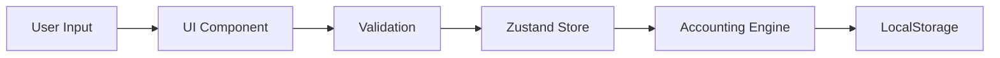
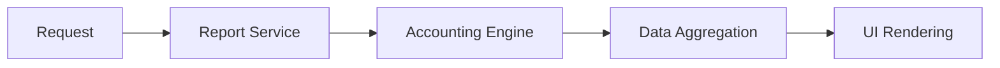

# アーキテクチャドキュメント

## 📐 システム構成

### レイヤードアーキテクチャ

```
┌──────────────────────────────────────────────────┐
│                 Presentation Layer                │
├──────────────────────────────────────────────────┤
│                 Application Layer                 │
├──────────────────────────────────────────────────┤
│                  Domain Layer                     │
├──────────────────────────────────────────────────┤
│               Infrastructure Layer                │
└──────────────────────────────────────────────────┘
```

## 🏛 各レイヤーの責務

### 1. Presentation Layer (UI)

#### ディレクトリ構造
```
src/ui/
├── app/                # アプリケーションルート
├── common/            # 共通コンポーネント
├── components/        # 再利用可能コンポーネント
├── layouts/           # レイアウトコンポーネント
├── transactions/      # 取引関連
├── statements/        # 財務諸表関連
├── ledgers/          # 帳簿関連
├── masters/          # マスタ管理
├── settings/         # 設定関連
└── styles/           # グローバルスタイル
```

#### 主要コンポーネント
- **App.tsx**: アプリケーションエントリーポイント
- **RouteManager.tsx**: ルーティング管理（遅延読み込み対応）
- **MainLayout.tsx**: メインレイアウト
- **Sidebar.tsx**: ナビゲーションサイドバー

### 2. Application Layer (Services)

#### ディレクトリ構造
```
src/services/
├── importService.ts      # インポート処理
├── exportService.ts      # エクスポート処理
├── bankImportService.ts  # 銀行明細取り込み
├── validationService.ts  # バリデーション
└── reportService.ts      # レポート生成
```

#### 責務
- ビジネスロジックの調整
- ドメインオブジェクトの操作
- トランザクション管理

### 3. Domain Layer

#### ディレクトリ構造
```
src/domain/
├── accountingEngine.ts   # 会計エンジン（中核）
├── entities/
│   ├── Journal.ts       # 仕訳エンティティ
│   ├── Account.ts       # 勘定科目エンティティ
│   └── Division.ts      # 区分エンティティ
├── valueObjects/
│   ├── Money.ts         # 金額値オブジェクト
│   └── AccountCode.ts   # 勘定科目コード
└── interfaces/
    └── *.interface.ts   # ドメインインターフェース
```

#### 中核概念
```typescript
// AccountingEngine - ドメインの中核
class AccountingEngine {
  private journals: Journal[]
  private accounts: Account[]
  private divisions: Division[]
  
  // ビジネスルールの実装
  addJournal(journal: Journal): void
  getTrialBalance(): TrialBalance
  getDivisionBalance(division: Division): Balance
}
```

### 4. Infrastructure Layer

#### ディレクトリ構造
```
src/stores/          # Zustand状態管理
src/utils/           # ユーティリティ
src/config/          # 設定
```

## 🔄 データフロー

### 1. 仕訳入力フロー


### 2. レポート生成フロー


## 🎨 UI/UXアーキテクチャ

### CSS設計方針

#### 1. CSS変数システム
```css
/* theme.css - 中央管理 */
:root {
  /* Colors */
  --color-primary: #3498db;
  --color-text-primary: #212529;
  
  /* Shadows */
  --shadow-sm: 0 1px 3px rgba(0,0,0,0.1);
  
  /* Transparent Colors */
  --color-primary-alpha-10: rgba(52,152,219,0.1);
}
```

#### 2. CSS Modules
```typescript
// コンポーネント固有のスタイル
import styles from './Component.module.css';

<div className={styles.container}>
```

#### 3. ダークモード対応
```css
[data-theme="dark"] {
  --color-text-primary: #e5e7eb;
  --color-bg-primary: #1a1a1a;
}
```

## 🗂 状態管理アーキテクチャ (Zustand)

### ストア構成
```typescript
// 統合ストア
interface AccountingStore {
  // 会計エンジン
  engine: AccountingEngine
  
  // UI状態
  activeMenu: string
  isLoading: boolean
  
  // アクション
  addJournal: (journal: Journal) => void
  updateAccount: (account: Account) => void
}
```

### ストアの分割
```
stores/
├── slices/
│   ├── accounting/    # 会計関連
│   ├── ui/           # UI状態
│   └── settings/     # 設定
└── index.ts          # ストア統合
```

## 🚀 パフォーマンス最適化

### 1. コード分割戦略
```typescript
// 動的インポートによる遅延読み込み
const FreeeStyleJournalForm = lazy(() => 
  import('../transactions/FreeeStyleJournalForm')
);
```

### 2. チャンク最適化
```javascript
// vite.config.ts
manualChunks: {
  'react-vendor': ['react', 'react-dom'],
  'date-vendor': ['date-fns'],
  'data-vendor': ['papaparse', 'xlsx'],
}
```

### 3. メモ化戦略
```typescript
// 高コストな計算のメモ化
const trialBalance = useMemo(() => 
  engine.getTrialBalance(), 
  [engine.journals]
);
```

## 🔒 セキュリティアーキテクチャ

### 1. データ検証
- 入力値の厳密な型チェック
- XSS対策（React自動エスケープ）
- CSRFトークン（将来実装）

### 2. 認証・認可（将来実装）
```typescript
interface AuthLayer {
  authenticate(): Promise<User>
  authorize(resource: string, action: string): boolean
}
```

## 📊 データモデル

### ER図（簡略版）
```
Journal (仕訳)
├─ id: string
├─ date: string
├─ description: string
├─ division: Division
├─ status: JournalStatus
└─ details: JournalDetail[]

JournalDetail (仕訳明細)
├─ accountCode: string
├─ debitAmount: number | null
└─ creditAmount: number | null

Account (勘定科目)
├─ code: string
├─ name: string
├─ category: AccountCategory
└─ isActive: boolean

Division (区分)
├─ code: DivisionCode
├─ name: string
└─ isActive: boolean
```

## 🔧 開発環境アーキテクチャ

### ビルドツール
- **Vite**: 高速な開発サーバーとビルド
- **TypeScript**: 型安全性の確保
- **ESLint**: コード品質の維持

### テスト戦略（将来実装）
```
tests/
├── unit/          # 単体テスト
├── integration/   # 統合テスト
└── e2e/          # E2Eテスト
```

## 📈 スケーラビリティ

### 水平スケール対応
- ステートレスなコンポーネント設計
- LocalStorage → API連携への移行パス
- マイクロフロントエンド対応可能な構造

### 垂直スケール対応
- 遅延読み込みによるメモリ効率化
- 仮想スクロールの導入余地
- Web Worker活用の検討

## 🎯 アーキテクチャ原則

1. **単一責任の原則 (SRP)**
   - 各コンポーネントは1つの責務のみ

2. **開放閉鎖の原則 (OCP)**
   - 拡張に対して開き、変更に対して閉じている

3. **依存性逆転の原則 (DIP)**
   - 抽象に依存し、具象に依存しない

4. **DRY原則**
   - 重複を避け、再利用可能なコードを書く

5. **KISS原則**
   - シンプルで理解しやすい設計を維持