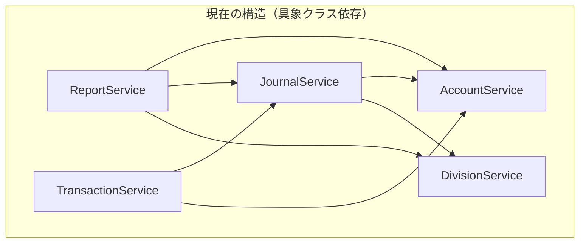
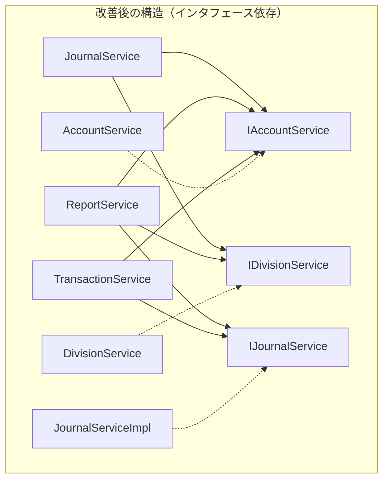

# 依存関係改善 詳細設計書

*作成日: 2025-01-18*  
*Phase 2: サービス層の依存性改善*

## 1. 現状の依存関係構造

### 1.1 問題のある依存パターン



### 1.2 問題点
- **密結合**: サービスが具象クラスに直接依存
- **テスト困難**: モックの注入が困難
- **変更の波及**: 一つのサービス変更が多くに影響

## 2. 改善後の設計

### 2.1 インタフェースベースの構造



### 2.2 利点
- **疎結合**: インタフェースを介した依存
- **テスト容易**: モックオブジェクトの注入が簡単
- **変更の局所化**: 実装変更が他に影響しない

## 3. 段階的移行戦略

### Step 1: インタフェース実装（破壊的変更なし）
```typescript
// 既存クラスにインタフェースを実装
export class JournalService implements IJournalService {
  // 既存の実装を維持
}
```

### Step 2: 依存の段階的変更
```typescript
// Phase 1: オプショナルなインタフェース依存
constructor(
  accountService: AccountService | IAccountService,
  divisionService: DivisionService | IDivisionService
) {
  // 両方を受け入れる
}

// Phase 2: インタフェースのみ
constructor(
  accountService: IAccountService,
  divisionService: IDivisionService
) {
  // インタフェースのみ受け入れる
}
```

### Step 3: ファクトリーパターンの導入
```typescript
export class ServiceFactory {
  static createJournalService(): IJournalService {
    return new JournalService(
      ServiceFactory.createAccountService(),
      ServiceFactory.createDivisionService()
    );
  }
}
```

## 4. 実装優先順位

### 優先度1: コアサービス
1. **JournalService** - 最も多く依存される
2. **AccountService** - 基盤サービス（完了済み）
3. **DivisionService** - 基盤サービス

### 優先度2: ビジネスサービス
4. **ReportService** - 3つのコアサービスに依存
5. **TransactionService** - 仕訳と勘定科目に依存
6. **AuxiliaryService** - 補助元帳管理

### 優先度3: アプリケーションサービス
7. **ImportExportService** - データ入出力
8. **ClosingService** - 決算処理
9. **SampleDataService** - サンプルデータ

## 5. テスト戦略

### 5.1 モックの作成
```typescript
// __mocks__/AccountService.mock.ts
export class MockAccountService implements IAccountService {
  private mockAccounts = new Map<string, any>();
  
  getAccount(code: string) {
    return this.mockAccounts.get(code);
  }
  
  getAccounts() {
    return Array.from(this.mockAccounts.values());
  }
  
  // テスト用ヘルパー
  addMockAccount(account: any) {
    this.mockAccounts.set(account.code, account);
  }
}
```

### 5.2 依存性注入を使ったテスト
```typescript
describe('JournalService with mocks', () => {
  let journalService: IJournalService;
  let mockAccountService: MockAccountService;
  let mockDivisionService: MockDivisionService;
  
  beforeEach(() => {
    mockAccountService = new MockAccountService();
    mockDivisionService = new MockDivisionService();
    journalService = new JournalService(
      mockAccountService,
      mockDivisionService
    );
  });
  
  it('should create journal with mocked dependencies', () => {
    // モックを使ったテスト
  });
});
```

## 6. 移行チェックリスト

### Phase 2-1: インタフェース実装
- [x] IAccountService実装（AccountService）
- [ ] IJournalService実装（JournalService）
- [ ] IDivisionService実装（DivisionService）

### Phase 2-2: 依存の抽象化
- [ ] JournalServiceの依存をインタフェースに
- [ ] ReportServiceの依存をインタフェースに
- [ ] TransactionServiceの依存をインタフェースに
- [ ] AuxiliaryServiceの依存をインタフェースに
- [ ] ImportExportServiceの依存をインタフェースに
- [ ] ClosingServiceの依存をインタフェースに
- [ ] SampleDataServiceの依存をインタフェースに

### Phase 2-3: テスト改善
- [ ] モッククラスの作成
- [ ] 既存テストの更新
- [ ] 新規単体テストの追加

### Phase 2-4: ファクトリー導入
- [ ] ServiceFactoryクラスの作成
- [ ] AccountingEngineの改善
- [ ] DIコンテナの検討

## 7. リスクと対策

### リスク1: 既存コードの破壊
**対策**: 
- 段階的な移行
- 後方互換性の維持
- 充実したテスト

### リスク2: パフォーマンス低下
**対策**:
- インタフェース呼び出しのオーバーヘッドは最小
- 必要に応じて最適化

### リスク3: 複雑性の増加
**対策**:
- シンプルなインタフェース設計
- 明確な命名規則
- ドキュメントの充実

## 8. 期待される成果

### 定量的指標
- 具象クラス依存: 15箇所 → 0箇所
- モック可能率: 20% → 100%
- テストカバレッジ: 40% → 70%

### 定性的効果
- 新機能追加の容易さ向上
- バグ修正時の影響範囲限定
- チーム開発の効率化

---

*次回更新: Phase 2-1完了時*