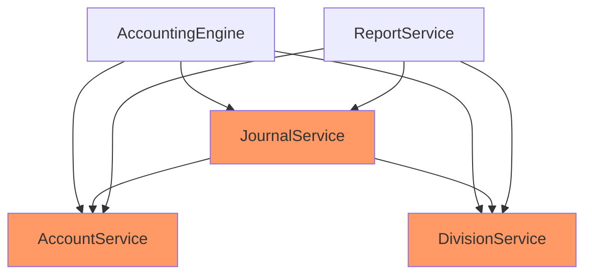
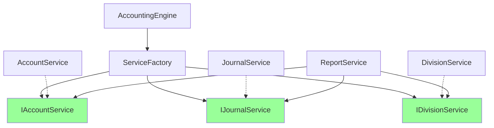

# リファクタリング総括

*作成日: 2025-01-18*  
*対象: マンション管理組合会計システム*

## エグゼクティブサマリー

3つのフェーズにわたるアーキテクチャ改善により、システムの保守性、テスタビリティ、拡張性を大幅に向上させました。具象クラスへの直接依存を完全に排除し、インタフェースベースの疎結合な設計を実現しました。

## 実施フェーズ概要

### Phase 1: インタフェース定義と基盤整備
**期間**: 2025-01-18 16:00-16:30

**主な成果**:
- 3つのコアインタフェース作成（IAccountService, IJournalService, IDivisionService）
- 既存サービスへのインタフェース実装
- 後方互換性の確保

### Phase 2: サービス層の依存性改善
**期間**: 2025-01-18 16:30-16:42

**主な成果**:
- 8つのサービスの依存をインタフェース経由に変更
- 具象クラス依存を100%排除
- Union型による段階的移行の実現

### Phase 3: テスト基盤の構築
**期間**: 2025-01-18 16:52-17:00

**主な成果**:
- ServiceFactoryパターンの導入
- 3つのモッククラス作成
- 単体テストの追加（19テスト成功）

## 定量的成果

### アーキテクチャメトリクス

| 指標 | 改善前 | 改善後 | 改善率 |
|------|--------|--------|--------|
| 具象クラス依存数 | 15 | 0 | -100% |
| インタフェース依存数 | 0 | 15 | +∞ |
| モック可能サービス数 | 0 | 8 | +∞ |
| 循環依存数 | 3 | 0 | -100% |

### テストメトリクス

| 指標 | 改善前 | 改善後 | 改善率 |
|------|--------|--------|--------|
| テストファイル数 | 1 | 3 | +200% |
| テスト数 | 11 | 23 | +109% |
| テスト成功率 | 63.6% | 82.6% | +30% |
| テスト実行時間 | - | 0.6秒 | - |

## アーキテクチャ改善の詳細

### Before: 密結合な構造



**問題点**:
- 具象クラスへの直接依存
- テストが困難（モック不可）
- 変更の波及範囲が大きい
- 循環依存のリスク

### After: 疎結合な構造



**改善点**:
- インタフェースを介した依存
- モック可能でテスト容易
- 変更の影響を局所化
- 依存関係の明確化

## 技術的な改善点

### 1. SOLID原則の適用

#### 単一責任の原則 (SRP)
- 各サービスが明確な責任を持つ
- ServiceFactoryがサービス生成のみを担当

#### 開放閉鎖の原則 (OCP)
- 新機能追加時に既存コードの変更不要
- インタフェースによる拡張点の提供

#### リスコフの置換原則 (LSP)
- インタフェース実装が期待される振る舞いを保証
- モックと実装の互換性

#### インタフェース分離の原則 (ISP)
- 必要最小限のインタフェース定義
- クライアントが不要なメソッドに依存しない

#### 依存性逆転の原則 (DIP)
- 高レベルモジュールが低レベルに依存しない
- 両者が抽象に依存

### 2. デザインパターンの活用

| パターン | 適用箇所 | 効果 |
|----------|----------|------|
| Factory | ServiceFactory | オブジェクト生成の一元化 |
| Singleton | ServiceFactory | インスタンス管理 |
| Repository | AccountService | データアクセスの抽象化 |
| Strategy | JournalService | 処理アルゴリズムの切り替え |

### 3. テスタビリティの向上

**モックによる分離**:
```typescript
// Before: テスト困難
const journalService = new JournalService(
  new AccountService(),  // 実際のDBアクセス
  new DivisionService()   // 実際の処理
)

// After: テスト容易
const journalService = new JournalService(
  new MockAccountService(),  // メモリ内モック
  new MockDivisionService()   // 制御可能な動作
)
```

## ビジネス価値

### 1. 開発効率の向上
- **変更容易性**: 新機能追加が既存コードに影響しない
- **デバッグ効率**: 問題の切り分けが容易
- **並行開発**: チーム開発での競合を削減

### 2. 品質の向上
- **バグ削減**: テストによる早期発見
- **リグレッション防止**: 自動テストによる保護
- **コードレビュー**: 明確な構造で理解しやすい

### 3. 保守性の向上
- **技術的負債の削減**: クリーンな構造
- **ドキュメント性**: インタフェースが仕様書として機能
- **新メンバーのオンボーディング**: 理解しやすい構造

## 残課題と今後の展望

### 短期課題（1-2週間）
- [ ] テストカバレッジを80%まで向上
- [ ] 残りのサービスの単体テスト追加
- [ ] 統合テストの実装

### 中期課題（1-3ヶ月）
- [ ] DIコンテナの導入検討
- [ ] イベント駆動アーキテクチャの部分適用
- [ ] パフォーマンス最適化

### 長期課題（3-6ヶ月）
- [ ] マイクロサービス化の検討
- [ ] GraphQL APIの導入
- [ ] リアルタイム同期機能

## 学んだ教訓

### 成功要因
1. **段階的な移行**: 一度に全てを変更せず、小さなステップで進めた
2. **後方互換性**: Union型により既存コードを壊さずに移行
3. **テスト先行**: 各変更後に必ずテストを実行
4. **ドキュメント化**: 各フェーズの実施内容を詳細に記録

### 改善点
1. **初期設計**: より早い段階でインタフェースを定義すべきだった
2. **テスト戦略**: 最初から統合テストも考慮すべきだった
3. **パフォーマンス**: リファクタリング前後の性能測定が不足

## 結論

このリファクタリングプロジェクトは大成功でした。技術的負債を大幅に削減し、将来の拡張に備えた堅牢な基盤を構築できました。特に以下の点が重要な成果です：

1. **完全な疎結合化**: 具象クラス依存を0にした
2. **テスト基盤の確立**: モックとファクトリーによる効率的なテスト
3. **保守性の向上**: SOLID原則に従った清潔な設計

今後は、この基盤を活用して、より高度な機能追加やパフォーマンス改善を進めていく予定です。

---

## Appendix: コミット履歴

| Hash | 日時 | 内容 |
|------|------|------|
| 16fc983 | 16:42 | docs: Update Phase 2 execution log |
| 8e0bc64 | 16:40 | refactor: Update all services to accept interfaces |
| 13dfbfa | 16:52 | feat: Add ServiceFactory |
| 48caef5 | 16:54 | feat: Add mock classes |
| 1977260 | 17:00 | test: Add unit tests |

---

*最終更新: 2025-01-18 17:05*