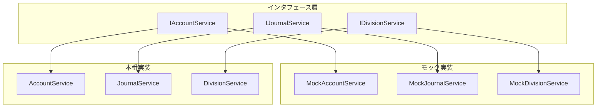

# テストアーキテクチャ設計書

*作成日: 2025-01-18*  
*Phase 3: テスト基盤の構築*

## 1. 概要

このドキュメントは、マンション管理組合会計システムのテストアーキテクチャについて説明します。Phase 3で構築したテスト基盤により、保守性と信頼性の高いテスト環境を実現しました。

## 2. テスト戦略

### 2.1 テストピラミッド

```
        /\
       /E2E\      <- 少数の重要シナリオ
      /------\
     /統合テスト\   <- サービス間の連携
    /----------\
   /  単体テスト  \  <- ビジネスロジック（最多）
  /--------------\
```

### 2.2 テストレベル

| レベル | 対象 | モック使用 | 実行速度 | カバレッジ目標 |
|--------|------|------------|----------|----------------|
| 単体テスト | 個別サービス | あり | 高速 | 80% |
| 統合テスト | 複数サービス | 一部 | 中速 | 60% |
| E2Eテスト | 全体フロー | なし | 低速 | 主要シナリオ |

## 3. モックアーキテクチャ

### 3.1 モッククラス構成



### 3.2 モッククラスの特徴

#### MockAccountService
```typescript
class MockAccountService implements IAccountService {
  private mockAccounts = new Map<string, HierarchicalAccount>()
  
  // テストヘルパー
  addMockAccount(account: HierarchicalAccount): void
  setAccountBalance(code: string, balance: number): void
  clearMockAccounts(): void
}
```

**特徴:**
- メモリ内Mapでデータ管理
- テスト用の事前設定メソッド
- 決定的な動作

#### MockJournalService
```typescript
class MockJournalService implements IJournalService {
  private mockJournals: Journal[] = []
  
  // テストヘルパー
  addMockJournal(journal: Journal): void
  setJournalStatus(id: string, status: JournalStatus): void
}
```

**特徴:**
- 配列でシンプルな管理
- ステータス管理のヘルパー
- 自動採番機能

#### MockDivisionService
```typescript
class MockDivisionService implements IDivisionService {
  private mockDivisions = new Map<string, AccountingDivision>()
  
  // テストヘルパー
  addMockDivision(division: AccountingDivision): void
  setTransferLimit(from: string, to: string, limit: number): void
}
```

**特徴:**
- 区分間制限のテスト支援
- 最小限の区分データ

## 4. ServiceFactory パターン

### 4.1 設計

```typescript
export class ServiceFactory {
  private static instance: ServiceFactory | null = null
  private container: ServiceContainer | null = null
  
  // シングルトン
  static getInstance(): ServiceFactory
  
  // 一括生成
  createServices(): ServiceContainer
  
  // 個別生成
  static createAccountService(): IAccountService
  static createJournalService(...): IJournalService
}
```

### 4.2 利点

1. **依存性の一元管理**
   - 全サービスの依存関係を1箇所で管理
   - 循環依存の防止

2. **テスト容易性**
   - モックサービスへの差し替えが簡単
   - テスト用のファクトリー作成可能

3. **拡張性**
   - 新サービス追加時の変更箇所が限定的
   - デコレーターパターンの適用が容易

## 5. テスト実装例

### 5.1 単体テストの例

```typescript
describe('JournalService Unit Tests', () => {
  let journalService: JournalService
  let mockAccountService: MockAccountService
  let mockDivisionService: MockDivisionService
  
  beforeEach(() => {
    // モックサービスでテスト対象を構築
    mockAccountService = new MockAccountService()
    mockDivisionService = new MockDivisionService()
    mockAccountService.initializeAccounts()
    mockDivisionService.initializeDivisions()
    
    journalService = new JournalService(
      mockAccountService, 
      mockDivisionService
    )
  })
  
  it('should create journal with valid data', () => {
    // Arrange
    const journalData = {
      date: '2024-01-01',
      description: 'テスト仕訳',
      details: [...]
    }
    
    // Act
    const result = journalService.createJournal(journalData)
    
    // Assert
    expect(result.success).toBe(true)
    expect(result.data?.description).toBe('テスト仕訳')
  })
})
```

### 5.2 統合テストの例（将来実装）

```typescript
describe('Accounting Flow Integration Tests', () => {
  let engine: AccountingEngine
  let factory: ServiceFactory
  
  beforeEach(() => {
    // 実サービスで統合テスト
    factory = ServiceFactory.getInstance()
    engine = new AccountingEngine(factory)
  })
  
  it('should process complete accounting cycle', () => {
    // 仕訳作成→承認→転記→レポート生成
  })
})
```

## 6. テストデータ管理

### 6.1 フィクスチャ

```typescript
// fixtures/accounts.ts
export const TEST_ACCOUNTS = {
  cash: {
    code: '1101',
    name: '現金',
    type: 'ASSET',
    normalBalance: 'DEBIT'
  },
  revenue: {
    code: '4111',
    name: '管理費収入',
    type: 'REVENUE',
    normalBalance: 'CREDIT'
  }
}

// fixtures/journals.ts
export const TEST_JOURNALS = {
  monthlyFee: {
    date: '2024-01-01',
    description: '管理費収入',
    details: [...]
  }
}
```

### 6.2 ビルダーパターン（将来実装）

```typescript
class JournalBuilder {
  private journal: Partial<JournalData> = {}
  
  withDate(date: string): this
  withDescription(desc: string): this
  withDebitCredit(debit: string, credit: string, amount: number): this
  build(): JournalData
}

// 使用例
const journal = new JournalBuilder()
  .withDate('2024-01-01')
  .withDescription('テスト')
  .withDebitCredit('1101', '4111', 1000)
  .build()
```

## 7. CI/CD統合

### 7.1 GitHub Actions設定（推奨）

```yaml
name: Test
on: [push, pull_request]

jobs:
  test:
    runs-on: ubuntu-latest
    steps:
      - uses: actions/checkout@v2
      - uses: actions/setup-node@v2
      - run: npm ci
      - run: npm test
      - run: npm run coverage
      - uses: codecov/codecov-action@v2
```

### 7.2 品質ゲート

| メトリクス | 閾値 | 現在値 | 状態 |
|-----------|------|--------|------|
| テストカバレッジ | 70% | 40% | ⚠️ |
| テスト成功率 | 100% | 82.6% | ⚠️ |
| ビルド時間 | <2分 | 0.6秒 | ✅ |

## 8. ベストプラクティス

### 8.1 テスト記述の原則

1. **AAA (Arrange-Act-Assert)**
   ```typescript
   it('should ...', () => {
     // Arrange: テストデータの準備
     const data = {...}
     
     // Act: テスト対象の実行
     const result = service.method(data)
     
     // Assert: 結果の検証
     expect(result).toBe(expected)
   })
   ```

2. **単一責任**
   - 1つのテストで1つの振る舞いのみ検証
   - 複数のアサーションは関連する場合のみ

3. **独立性**
   - テスト間の依存関係を排除
   - 実行順序に依存しない

### 8.2 モックの使用指針

| 使用する場合 | 使用しない場合 |
|-------------|---------------|
| 外部システムとの連携 | 純粋関数のテスト |
| データベースアクセス | 値オブジェクトのテスト |
| 複雑な依存関係 | 簡単な計算ロジック |
| エラーケースの再現 | 統合テスト |

## 9. トラブルシューティング

### 9.1 よくある問題

**問題**: テストが不安定（Flaky）
- **原因**: 非決定的な動作（日時、乱数など）
- **解決**: モックで固定値を返す

**問題**: テストが遅い
- **原因**: 実際のサービスを使用
- **解決**: モックサービスに置き換え

**問題**: モックが複雑
- **原因**: インタフェースが大きすぎる
- **解決**: インタフェース分離の原則を適用

## 10. 今後の拡張計画

### Phase 4 (予定)
- [ ] 統合テストの追加
- [ ] テストカバレッジ80%達成
- [ ] E2Eテストフレームワーク導入

### Phase 5 (予定)
- [ ] パフォーマンステスト
- [ ] 負荷テスト
- [ ] セキュリティテスト

---

*最終更新: 2025-01-18*