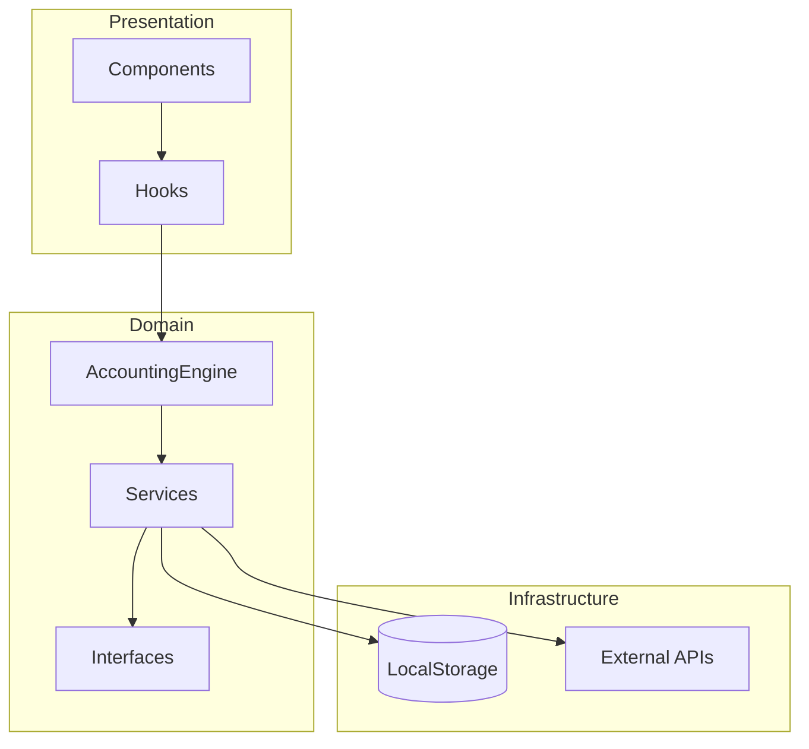
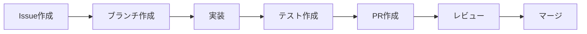

# 開発者ガイド

*最終更新: 2025-08-19*  
*バージョン: 2.0*

## 目次

1. [はじめに](#はじめに)
2. [環境構築](#環境構築)
3. [アーキテクチャ概要](#アーキテクチャ概要)
4. [開発フロー](#開発フロー)
5. [コーディング規約](#コーディング規約)
6. [テスト](#テスト)
7. [デバッグ](#デバッグ)
8. [トラブルシューティング](#トラブルシューティング)

## はじめに

このガイドは、マンション管理組合会計システムの開発に参加する開発者向けのドキュメントです。システムの構造、開発手順、ベストプラクティスについて説明します。

### 前提知識
- TypeScript（中級以上）
- React（基礎知識）
- 複式簿記の基本概念
- Git/GitHub

## 環境構築

### 必要なツール

```bash
# Node.js (v18以上)
node --version

# npm または yarn
npm --version

# Git
git --version
```

### プロジェクトのセットアップ

```bash
# リポジトリのクローン
git clone https://github.com/junwatanabe72/account.git
cd account

# 依存関係のインストール
npm install

# 開発サーバー起動
npm run dev

# テスト実行
npm test
```

### 推奨エディタ設定

**VSCode拡張機能**:
- ESLint
- Prettier
- TypeScript and JavaScript Language Features
- Vitest Runner

**.vscode/settings.json**:
```json
{
  "editor.formatOnSave": true,
  "editor.codeActionsOnSave": {
    "source.fixAll.eslint": true
  },
  "typescript.preferences.importModuleSpecifier": "relative"
}
```

## アーキテクチャ概要

### ディレクトリ構造

```
src/
├── domain/                 # ドメイン層
│   ├── AccountingEngine.ts # メインエントリーポイント
│   ├── interfaces/         # インタフェース定義
│   ├── services/           # ビジネスロジック
│   └── __mocks__/         # モッククラス
├── components/            # Reactコンポーネント
├── hooks/                 # カスタムフック
├── types/                 # 型定義
├── constants/             # 定数定義
└── __tests__/            # テスト
```

### レイヤーアーキテクチャ



### 主要クラスとインタフェース

#### AccountingEngine
システムのファサード。全機能への統一インタフェース。

```typescript
const engine = new AccountingEngine()

// 仕訳作成
const result = engine.createJournal({
  date: '2024-01-01',
  description: '管理費収入',
  details: [
    { accountCode: '1101', debitAmount: 10000 },
    { accountCode: '4111', creditAmount: 10000 }
  ]
})
```

#### ServiceFactory
サービスの生成と依存性管理。

```typescript
const factory = ServiceFactory.getInstance()
const services = factory.createServices()
```

## 開発フロー

### 1. 機能開発の流れ



### 2. ブランチ戦略

```bash
main                 # 本番環境
├── develop         # 開発環境
    ├── feature/*   # 新機能
    ├── fix/*       # バグ修正
    └── refactor/*  # リファクタリング
```

### 3. コミットメッセージ

```bash
# 形式
<type>: <subject>

# 例
feat: Add budget management module
fix: Correct balance calculation error
refactor: Improve service dependency injection
docs: Update developer guide
test: Add unit tests for ReportService
```

**タイプ一覧**:
- `feat`: 新機能
- `fix`: バグ修正
- `refactor`: リファクタリング
- `docs`: ドキュメント
- `test`: テスト
- `chore`: その他

## コーディング規約

### TypeScript

#### 命名規則

```typescript
// インタフェース: PascalCase + I prefix
interface IAccountService { }

// クラス: PascalCase
class AccountService { }

// 関数・メソッド: camelCase
function calculateBalance() { }

// 定数: UPPER_SNAKE_CASE
const MAX_RETRY_COUNT = 3

// 変数: camelCase
let accountBalance = 0
```

#### 型定義

```typescript
// 明示的な型定義を推奨
const getAccount = (code: string): Account | undefined => {
  // ...
}

// anyの使用は避ける
// ❌ Bad
let data: any = {}

// ✅ Good
let data: Record<string, unknown> = {}
```

#### エラーハンドリング

```typescript
// Result型パターンを使用
interface Result<T> {
  success: boolean
  data?: T
  errors?: string[]
}

// 使用例
function createJournal(data: JournalData): Result<Journal> {
  try {
    // 処理
    return { success: true, data: journal }
  } catch (error) {
    return { 
      success: false, 
      errors: [error.message] 
    }
  }
}
```

### React

#### コンポーネント定義

```typescript
// 関数コンポーネントを使用
interface Props {
  title: string
  onSubmit: (data: FormData) => void
}

const MyComponent: React.FC<Props> = ({ title, onSubmit }) => {
  return <div>{title}</div>
}
```

#### Hooks使用規則

```typescript
// カスタムフックは use prefix
const useAccounting = () => {
  const [engine] = useState(() => new AccountingEngine())
  
  return {
    createJournal: engine.createJournal.bind(engine),
    getTrialBalance: engine.getTrialBalance.bind(engine)
  }
}
```

## テスト

### テスト戦略

```
単体テスト (Unit)        - 個別の関数・クラス
統合テスト (Integration) - 複数のコンポーネント
E2Eテスト (E2E)         - ユーザーシナリオ
```

### 単体テストの書き方

```typescript
import { describe, it, expect, beforeEach } from 'vitest'
import { MockAccountService } from '../__mocks__'
import { JournalService } from '../services/JournalService'

describe('JournalService', () => {
  let service: JournalService
  let mockAccount: MockAccountService
  
  beforeEach(() => {
    // Arrange
    mockAccount = new MockAccountService()
    service = new JournalService(mockAccount)
  })
  
  it('should create journal with valid data', () => {
    // Arrange
    const data = { /* ... */ }
    
    // Act
    const result = service.createJournal(data)
    
    // Assert
    expect(result.success).toBe(true)
  })
})
```

### テストコマンド

```bash
# 全テスト実行
npm test

# ウォッチモード
npm run test:watch

# カバレッジ
npm run test:coverage

# 特定ファイルのみ
npm test JournalService
```

### モックの使用

```typescript
// モッククラスを使用
import { MockAccountService, MockJournalService } from '../__mocks__'

const mockAccount = new MockAccountService()
mockAccount.addMockAccount({
  code: '1101',
  name: '現金',
  balance: 10000
})

// テスト用ヘルパーメソッド
mockAccount.setAccountBalance('1101', 20000)
```

## デバッグ

### デバッグツール

#### ブラウザDevTools
```typescript
// ブレークポイント
debugger

// コンソール出力
console.log('Current state:', state)
console.table(accounts)
console.group('Journal Details')
console.log(journal)
console.groupEnd()
```

#### VSCode デバッガー

**.vscode/launch.json**:
```json
{
  "version": "0.2.0",
  "configurations": [
    {
      "type": "chrome",
      "request": "launch",
      "name": "Debug React",
      "url": "http://localhost:3000",
      "webRoot": "${workspaceFolder}/src"
    }
  ]
}
```

### パフォーマンス分析

```typescript
// 実行時間計測
console.time('calculation')
const result = expensiveCalculation()
console.timeEnd('calculation')

// React DevTools Profiler
// React.Profiler コンポーネントを使用
```

## トラブルシューティング

### よくある問題と解決方法

#### 1. 依存関係エラー

**問題**: `Cannot find module`
```bash
# 解決方法
rm -rf node_modules package-lock.json
npm install
```

#### 2. 型エラー

**問題**: TypeScriptの型エラー
```typescript
// tsconfig.json の確認
{
  "compilerOptions": {
    "strict": true,
    "skipLibCheck": true
  }
}
```

#### 3. テスト失敗

**問題**: モックが正しく動作しない
```typescript
// beforeEach で初期化
beforeEach(() => {
  jest.clearAllMocks()
  // または
  vi.clearAllMocks()
})
```

#### 4. ビルドエラー

**問題**: ビルドが失敗する
```bash
# キャッシュクリア
npm run clean
npm run build
```

### デバッグチェックリスト

- [ ] エラーメッセージを完全に読む
- [ ] 関連するログを確認
- [ ] 最小限の再現コードを作成
- [ ] 関連するテストを実行
- [ ] ドキュメントを確認
- [ ] 類似のIssueを検索

## ベストプラクティス

### コード品質

1. **単一責任の原則**: 1つのクラス/関数は1つの責任
2. **DRY原則**: 重複を避ける
3. **YAGNI原則**: 必要になるまで実装しない
4. **早期リターン**: ネストを減らす

```typescript
// ❌ Bad
function process(data: Data) {
  if (data) {
    if (data.isValid) {
      // 処理
    }
  }
}

// ✅ Good
function process(data: Data) {
  if (!data) return
  if (!data.isValid) return
  // 処理
}
```

### セキュリティ

1. **入力検証**: 全ての入力を検証
2. **エスケープ処理**: XSS対策
3. **依存関係更新**: 定期的なアップデート

```typescript
// 入力検証の例
function validateAmount(amount: unknown): number {
  if (typeof amount !== 'number') {
    throw new Error('Amount must be a number')
  }
  if (amount < 0) {
    throw new Error('Amount must be positive')
  }
  return amount
}
```

### パフォーマンス

1. **メモ化**: 重い計算結果をキャッシュ
2. **遅延読み込み**: 必要時にのみロード
3. **バッチ処理**: 複数の更新をまとめる

```typescript
// メモ化の例
const memoizedCalculation = useMemo(() => {
  return expensiveCalculation(data)
}, [data])
```

## リソース

### 内部ドキュメント
- [システムアーキテクチャ](./SYSTEM_ARCHITECTURE.md)
- [ロードマップ](./ROADMAP.md)
- [API仕様書](../api/README.md)

### 外部リソース
- [TypeScript公式](https://www.typescriptlang.org/)
- [React公式](https://react.dev/)
- [Vitest公式](https://vitest.dev/)
- [複式簿記入門](https://example.com/bookkeeping)

### コミュニティ
- GitHub Issues: バグ報告・機能要望
- Discussions: 質問・議論
- Wiki: 追加ドキュメント

---

## 連絡先

質問や提案がある場合は、以下の方法でご連絡ください：

- GitHub Issues: [https://github.com/junwatanabe72/account/issues](https://github.com/junwatanabe72/account/issues)
- Email: support@example.com

---

*最終更新: 2025-08-19*  
*ドキュメントバージョン: 2.0*