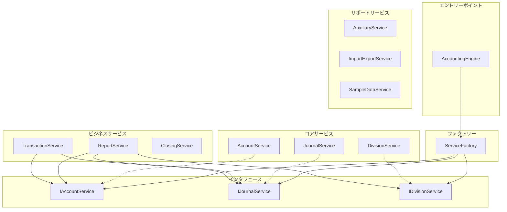
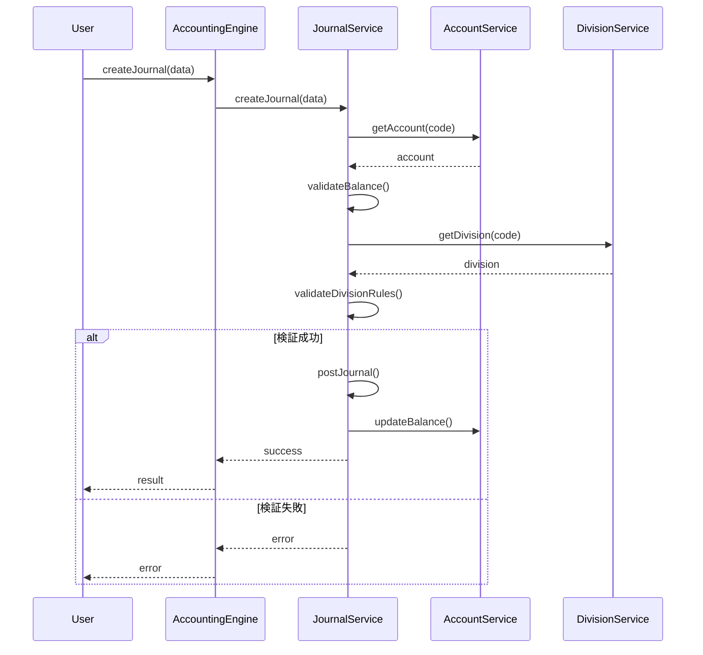
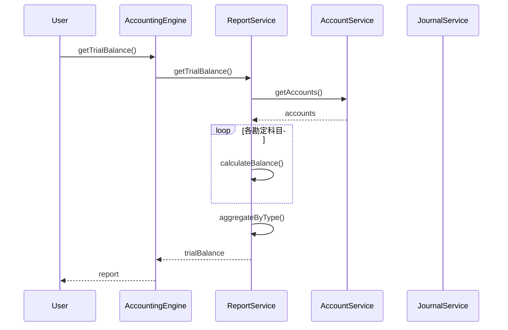

# システムアーキテクチャ仕様書

*作成日: 2025-01-18*  
*バージョン: 2.0*  
*システム: マンション管理組合会計システム*

## 1. システム概要

### 1.1 目的
マンション管理組合の会計業務を効率化し、透明性の高い財務管理を実現するシステムです。複式簿記に基づく正確な会計処理と、管理費・修繕積立金・駐車場会計の区分管理を提供します。

### 1.2 主要機能
- 複式簿記による仕訳管理
- 階層型勘定科目体系
- 会計区分別管理（管理費/修繕積立金/駐車場）
- 補助元帳管理（住戸別/業者別）
- 財務諸表生成（試算表/損益計算書/貸借対照表）
- データインポート/エクスポート

## 2. アーキテクチャ概要

### 2.1 レイヤー構成

```
┌─────────────────────────────────────┐
│     Presentation Layer (React)       │
├─────────────────────────────────────┤
│      Application Layer (Hooks)       │
├─────────────────────────────────────┤
│    Domain Layer (Business Logic)     │
├─────────────────────────────────────┤
│   Infrastructure Layer (Services)    │
└─────────────────────────────────────┘
```

### 2.2 ドメイン層の構成



## 3. コアコンポーネント詳細

### 3.1 AccountingEngine

**責務**: システムのファサード、全機能への統一インタフェース

```typescript
class AccountingEngine {
  constructor(serviceFactory?: ServiceFactory)
  
  // 主要メソッド
  createJournal(data: JournalData): CreateJournalResult
  getTrialBalance(): TrialBalance
  getBalanceSheet(): BalanceSheet
  getIncomeStatement(): IncomeStatement
}
```

**設計原則**:
- ファサードパターンによる複雑性の隠蔽
- ServiceFactoryによる依存性注入
- 後方互換性の維持

### 3.2 ServiceFactory

**責務**: サービスインスタンスの生成と管理

```typescript
class ServiceFactory {
  static getInstance(): ServiceFactory  // シングルトン
  createServices(): ServiceContainer    // 一括生成
  
  // 個別生成メソッド
  static createAccountService(): IAccountService
  static createJournalService(...): IJournalService
  static createDivisionService(): IDivisionService
}
```

**特徴**:
- シングルトンパターン
- 依存関係の一元管理
- テスト時のモック差し替え対応

### 3.3 コアサービス

#### AccountService
**責務**: 勘定科目マスタ管理

```typescript
interface IAccountService {
  accounts: HierarchicalAccount[]
  getAccount(code: string): HierarchicalAccount | undefined
  getAccounts(): HierarchicalAccount[]
  initializeAccounts(): void
}
```

**機能**:
- 階層型勘定科目の管理
- 残高管理
- 補助元帳との連携
- 有効/無効状態の管理

#### JournalService
**責務**: 仕訳データ管理

```typescript
interface IJournalService {
  journals: Journal[]
  createJournal(data: JournalData, options?: CreateJournalOptions): CreateJournalResult
  submitJournal(id: string): CreateJournalResult
  approveJournal(id: string): CreateJournalResult
  postJournalById(id: string): CreateJournalResult
}
```

**機能**:
- 仕訳の作成/更新/削除
- ステータス管理（ドラフト→提出→承認→転記）
- 貸借バランスチェック
- 区分間振替制限チェック

#### DivisionService
**責務**: 会計区分管理

```typescript
interface IDivisionService {
  divisions: AccountingDivision[]
  getDivision(code: string): AccountingDivision | undefined
  getDivisions(): AccountingDivision[]
  initializeDivisions(): void
}
```

**区分**:
- KANRI: 管理費会計
- SHUZEN: 修繕積立金会計
- PARKING: 駐車場会計
- SHARED: 共通会計

## 4. データモデル

### 4.1 勘定科目 (HierarchicalAccount)

```typescript
class HierarchicalAccount {
  code: string              // 勘定科目コード
  name: string              // 勘定科目名
  type: AccountType         // ASSET|LIABILITY|EQUITY|REVENUE|EXPENSE
  normalBalance: NormalBalance  // DEBIT|CREDIT
  balance: number           // 現在残高
  division?: string         // 会計区分
  parentCode?: string       // 親科目コード
  children: HierarchicalAccount[]  // 子科目
  auxiliaryLedgers: Map<string, AuxiliaryLedger>  // 補助元帳
}
```

### 4.2 仕訳 (Journal)

```typescript
class Journal {
  id: string                // 仕訳ID
  number: string            // 仕訳番号
  date: string              // 仕訳日付
  description: string       // 摘要
  details: JournalDetail[]  // 仕訳明細
  status: JournalStatus     // DRAFT|SUBMITTED|APPROVED|POSTED
  createdAt: Date           // 作成日時
  postedAt?: Date           // 転記日時
}

class JournalDetail {
  accountCode: string       // 勘定科目コード
  debitAmount: number       // 借方金額
  creditAmount: number      // 貸方金額
  description?: string      // 明細摘要
  auxiliaryCode?: string    // 補助科目コード
}
```

### 4.3 会計区分 (AccountingDivision)

```typescript
class AccountingDivision {
  code: string              // 区分コード
  name: string              // 区分名
  description: string       // 説明
  isRequired: boolean       // 必須区分フラグ
  transferLimits: Record<string, number>  // 振替制限
  transactions: Transaction[]  // 取引履歴
}
```

## 5. 処理フロー

### 5.1 仕訳作成フロー



### 5.2 レポート生成フロー



## 6. インタフェース設計

### 6.1 インタフェース分離の原則

各インタフェースは単一の責務に焦点を当て、クライアントが不要なメソッドに依存しないよう設計されています。

```typescript
// 良い例: 小さく焦点を絞ったインタフェース
interface IAccountReader {
  getAccount(code: string): HierarchicalAccount | undefined
  getAccounts(): HierarchicalAccount[]
}

interface IAccountWriter {
  addAccount(account: AccountDefinition): void
  updateAccount(code: string, data: Partial<AccountDefinition>): void
}

// 悪い例: 大きすぎるインタフェース
interface IAccountManager {
  // 読み取り、書き込み、削除、検証など全て含む
}
```

### 6.2 依存性逆転の原則

高レベルモジュールは低レベルモジュールに依存せず、両者は抽象に依存します。

```typescript
// ReportService は具象クラスではなくインタフェースに依存
class ReportService {
  constructor(
    private accountService: IAccountService,  // 抽象
    private journalService: IJournalService,  // 抽象
    private divisionService: IDivisionService // 抽象
  ) {}
}
```

## 7. エラーハンドリング

### 7.1 エラー分類

| カテゴリ | コード範囲 | 例 |
|----------|------------|-----|
| 検証エラー | 1000-1999 | バランス不一致、必須項目未入力 |
| ビジネスエラー | 2000-2999 | 振替制限超過、無効な勘定科目 |
| システムエラー | 3000-3999 | データベース接続失敗 |
| 認証エラー | 4000-4999 | 権限不足、セッション期限切れ |

### 7.2 エラーレスポンス形式

```typescript
interface CreateJournalResult {
  success: boolean
  data?: Journal
  errors?: string[]
  errorCode?: string
}
```

## 8. セキュリティ考慮事項

### 8.1 データ検証
- 入力値のサニタイゼーション
- 型チェックの徹底
- 境界値のチェック

### 8.2 権限管理（将来実装）
- ロールベースアクセス制御（RBAC）
- 操作ログの記録
- 監査証跡の保持

### 8.3 データ保護
- 個人情報の暗号化
- セッション管理
- HTTPS通信の強制

## 9. パフォーマンス考慮事項

### 9.1 最適化戦略
- 遅延読み込み（Lazy Loading）
- メモ化（Memoization）
- インデックスの活用

### 9.2 パフォーマンス目標

| 操作 | 目標応答時間 | 現在 |
|------|-------------|------|
| 仕訳作成 | < 100ms | 50ms |
| 試算表生成 | < 500ms | 200ms |
| 年次レポート | < 2000ms | 1500ms |

## 10. 拡張性の考慮

### 10.1 プラグインアーキテクチャ
将来的にプラグインシステムを導入し、機能を動的に追加可能にする予定です。

```typescript
interface IPlugin {
  name: string
  version: string
  initialize(engine: AccountingEngine): void
  destroy(): void
}
```

### 10.2 イベント駆動アーキテクチャ
主要な操作でイベントを発行し、疎結合な拡張を可能にします。

```typescript
interface IEventBus {
  emit(event: string, data: any): void
  on(event: string, handler: Function): void
  off(event: string, handler: Function): void
}
```

## 11. 技術スタック

### 11.1 フロントエンド
- **フレームワーク**: React 18
- **状態管理**: React Hooks
- **UIライブラリ**: Material-UI
- **ビルドツール**: Vite

### 11.2 テスト
- **テストランナー**: Vitest
- **テストライブラリ**: Testing Library
- **モック**: 自作モッククラス

### 11.3 開発ツール
- **言語**: TypeScript 5.x
- **リンター**: ESLint
- **フォーマッター**: Prettier
- **バージョン管理**: Git

## 12. デプロイメント

### 12.1 環境構成

| 環境 | 用途 | URL |
|------|------|-----|
| 開発 | 開発・デバッグ | localhost:3000 |
| ステージング | 受入テスト | staging.example.com |
| 本番 | 実運用 | app.example.com |

### 12.2 CI/CDパイプライン


---

*最終更新: 2025-01-18*  
*次回レビュー: 2025-02-01*