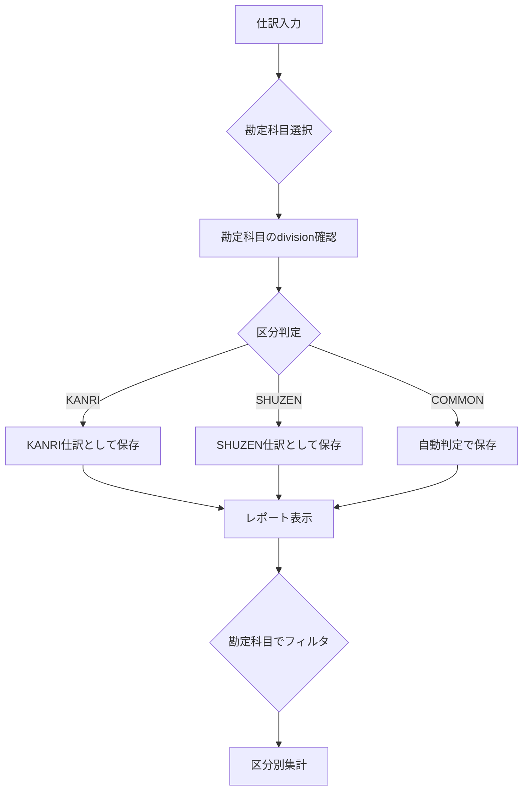

# 現在の実装分析 - 会計区分の取り扱い

## 調査結果サマリー

### 🔴 重大な問題
1. **仕訳データの区分が2つのみ**
   - `Division`型: `'KANRI' | 'SHUZEN'`
   - `PARKING`（駐車場）と`OTHER`（その他）が未定義

2. **区分の自動判定による問題**
   - 仕訳作成時に勘定科目の`division`から自動判定
   - ユーザーが明示的に区分を指定できない

3. **COMMON勘定科目の扱いが不明確**
   - 勘定科目マスタでは`COMMON`として定義
   - 実際の仕訳ではどの区分に属するか不明

## 詳細分析

### 1. 型定義の現状

#### src/types/journal.ts
```typescript
// 現在の定義（不完全）
export type Division = 'KANRI' | 'SHUZEN'
```

#### src/types/accounting.ts
```typescript
// こちらには完全な定義がある
export type DivisionCode = 'KANRI' | 'SHUZEN' | 'PARKING' | 'SPECIAL' | null
```

**問題**: 型定義が分散しており、一貫性がない

### 2. 仕訳入力フォームの現状

#### FreeeStyleJournalForm.tsx（283-286行目）
```typescript
division:
  fromAccount.division === "KANRI" && toAccount.division === "KANRI"
    ? "KANRI"
    : "SHUZEN",
```

**問題**: 
- 振替時の区分判定が単純すぎる
- PARKING、OTHERが考慮されていない
- ユーザーが区分を選択できない

### 3. レポート機能の現状

#### ReportService.ts（259, 360行目）
```typescript
if (!divisionCode || account.division === divisionCode || account.division === 'COMMON')
```

**現在の動作**:
- 勘定科目の`division`でフィルタリング
- `COMMON`勘定科目は全ての区分に含まれる

**問題**: 
- 仕訳の区分ではなく勘定科目の区分でフィルタリング
- 実際の取引がどの区分で行われたか不明

### 4. 勘定科目マスタの現状

#### defaultAccounts.ts
```typescript
// 勘定科目の区分定義例
{ code: '1101', name: '現金', divisionCode: 'KANRI' }
{ code: '1102', name: '普通預金', divisionCode: 'KANRI' }
{ code: '1103', name: '普通預金（修繕）', divisionCode: 'SHUZEN' }
{ code: '1301', name: '管理費未収金', divisionCode: 'KANRI' }
{ code: '1401', name: '前払保険料', divisionCode: 'COMMON' }
```

**観察**:
- 一部の勘定科目は特定区分専用
- 一部は`COMMON`として共通使用
- 区分の使い分けが明確でない

## 影響範囲

### 影響を受けるファイル
1. **型定義**
   - src/types/journal.ts
   - src/types/accounting.ts
   - src/types/accountingDivision.ts

2. **Domain層**
   - src/domain/services/core/JournalService.ts
   - src/domain/services/reporting/ReportService.ts

3. **UI層**
   - src/ui/transactions/FreeeStyleJournalForm.tsx
   - src/ui/transactions/UnifiedJournalForm.tsx
   - src/ui/statements/IncomeExpenseReport.tsx
   - src/ui/statements/DivisionStatementsPanel.tsx

4. **Store層**
   - src/stores/slices/journal/journalSlice.ts

## 現在の動作フロー



**問題点**:
1. PARKINGとOTHERの処理パスがない
2. COMMONの自動判定ロジックが不明確
3. 仕訳の実際の区分が保存されない可能性

## データサンプル分析

### 現在の仕訳データ構造
```javascript
{
  id: "j001",
  date: "2024-04-01",
  division: "KANRI",  // KANRIかSHUZENのみ
  details: [
    {
      accountCode: "4101",  // 管理費収入
      debitAmount: 0,
      creditAmount: 500000
    },
    {
      accountCode: "1102",  // 普通預金
      debitAmount: 500000,
      creditAmount: 0
    }
  ]
}
```

### 期待される仕訳データ構造
```javascript
{
  id: "j001",
  date: "2024-04-01",
  division: "PARKING",  // PARKING、OTHERも指定可能
  details: [
    {
      accountCode: "4201",  // 駐車場使用料収入
      debitAmount: 0,
      creditAmount: 100000
    },
    {
      accountCode: "1105",  // 普通預金（駐車場）
      debitAmount: 100000,
      creditAmount: 0
    }
  ]
}
```

## 推奨される修正優先順位

### 優先度1: 型定義の統一（必須）
- JournalDivision型の正しい定義
- 全ファイルでの一貫した使用

### 優先度2: 仕訳入力の改善（必須）
- 区分選択UIの追加
- 区分に応じた勘定科目フィルタリング

### 優先度3: レポート機能の修正（必須）
- 仕訳の区分でフィルタリング
- 正確な区分別集計

### 優先度4: データ移行（重要）
- 既存データの区分判定
- 不整合データの修正

### 優先度5: バリデーション強化（重要）
- 区分と勘定科目の整合性チェック
- 区分間振替のルール適用

## 結論

現在の実装は、マンション管理組合の会計で一般的な4区分（管理費、修繕積立金、駐車場、その他）のうち2区分しかサポートしていない。また、勘定科目の区分（COMMON含む）と仕訳の区分が混同されており、正確な区分別会計ができない状態である。

早急に以下の対応が必要：
1. 仕訳区分の完全な定義（4区分）
2. 明示的な区分指定機能
3. 区分に基づく正確な集計

これらの修正により、法的要件を満たす正確な区分経理が可能になる。