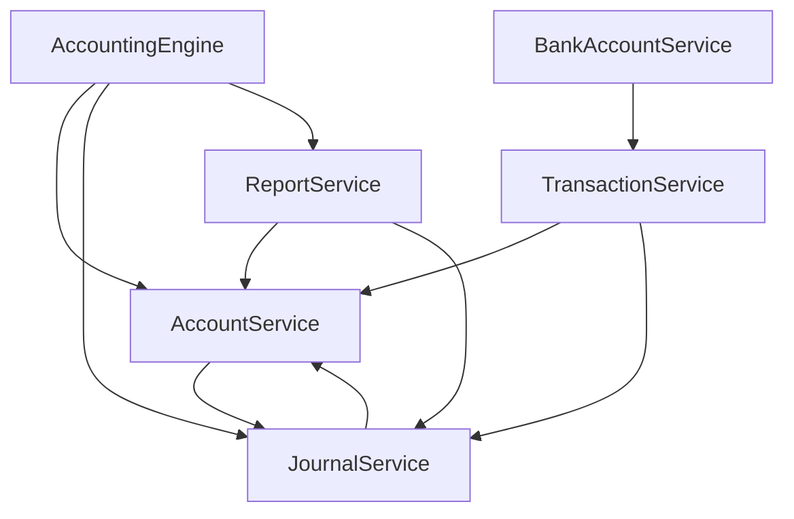

# マンション管理組合会計システム アーキテクチャレビューレポート

*作成日: 2025-01-18*  
*レビュアー: Senior System Architect*

## 📋 Executive Summary

本レビューでは、マンション管理組合会計システムの現状アーキテクチャを詳細に分析し、Clean Architecture / DDD の観点から重要な問題点と改善提案を特定しました。

---

## 🏗️ 1. 現状分析

### 1.1 良い点

#### ✅ **ドメイン層の概念的な分離**
- `/src/domain/` フォルダでドメインロジックが分離されている
- `AccountingEngine` がファサードパターンを適用し、複雑な依存関係を隠蔽

#### ✅ **サービス層の責務分割**
- 各ドメインサービスが明確な責務を持つ
- `AccountService`, `JournalService`, `ReportService` 等の責務が比較的明確

#### ✅ **型安全性**
- TypeScriptによる堅牢な型定義
- ドメインオブジェクトの型が適切に定義されている

### 1.2 重要な問題点

#### ❌ **深刻なアーキテクチャ境界違反**

**問題1: レイヤー間の循環依存**
```typescript
// accountingEngine.ts (ドメイン層)
import { AccountService } from './services/AccountService'  // ✅ 適切

// しかし実際の実装では...
// AccountService → JournalService → AccountService の循環依存が存在
```

**問題2: ドメインサービスとインフラストラクチャの混在**
```typescript
// /src/domain/services/ 内に複数の責務が混在
- AccountingServiceProvider.ts  // ❌ インフラストラクチャ層であるべき
- BankAccountService.ts        // ❌ インフラストラクチャ層であるべき  
- JournalService.ts (2つ存在) // ❌ 責務重複
```

**問題3: サービスの責務過多**
```typescript
// AccountingEngine.ts - 187行
// 15個のサービスを直接インスタンス化し、100個以上のメソッドを公開
// ❌ Single Responsibility Principle 違反
```

#### ❌ **ドメインモデルの貧血症候群**
- ドメインオブジェクトがデータ構造に過ぎない
- ビジネスロジックがサービス層に散在
- エンティティ自体にビジネス不変条件が含まれていない

#### ❌ **技術的負債の蓄積**
```typescript
// AccountService.ts
// ========================================
// 既存実装 - 段階的に新実装に置き換え中
// 新実装: AccountMasterService.ts を参照
// ========================================
```

---

## 🚨 2. 具体的な問題点詳細

### 2.1 SOLID原則違反

#### **Single Responsibility Principle (SRP) 違反**

**`AccountingEngine`** 
- 勘定科目管理
- 仕訳管理  
- レポート生成
- インポート/エクスポート
- 補助元帳管理
- 決算処理
- 取引管理

**❌ 問題**: 1つのクラスが7つ以上の責務を持っている

#### **Dependency Inversion Principle (DIP) 違反**

```typescript
// TransactionService.ts
private journalGenerationEngine: JournalGenerationEngine
constructor(
  private accountService: AccountService,      // 具象クラスに依存
  private journalService: JournalService,      // 具象クラスに依存
  bankAccountService?: BankAccountService      // 具象クラスに依存
)
```

**❌ 問題**: 抽象ではなく具象クラスに依存している

### 2.2 フォルダ構造の問題

```
src/
├── domain/           # ❌ ドメイン層とインフラ層が混在
│   ├── services/     # ❌ 14個のサービスが無秩序に配置
├── services/         # ❌ domain/services との責務重複
├── stores/           # ❌ 状態管理ロジックが分散
└── types/            # ✅ 型定義は適切
```

### 2.3 依存関係の問題



**❌ 問題**: 循環依存が複数箇所で発生

---

## 🏛️ 3. 改善提案

### 3.1 Clean Architecture準拠の新しいフォルダ構造

```
src/
├── domain/                          # ドメイン層
│   ├── entities/                    # エンティティ
│   │   ├── account/
│   │   │   ├── Account.ts
│   │   │   ├── AccountType.ts
│   │   │   └── ChartOfAccounts.ts
│   │   ├── journal/
│   │   │   ├── Journal.ts
│   │   │   ├── JournalEntry.ts
│   │   │   └── JournalStatus.ts
│   │   └── auxiliary/
│   │       ├── UnitOwner.ts
│   │       └── Vendor.ts
│   ├── value-objects/               # 値オブジェクト
│   │   ├── Money.ts
│   │   ├── AccountCode.ts
│   │   ├── JournalDate.ts
│   │   └── DivisionCode.ts
│   ├── aggregates/                  # 集約
│   │   ├── AccountingPeriod.ts
│   │   └── TrialBalance.ts
│   ├── domain-services/             # ドメインサービス
│   │   ├── JournalValidationService.ts
│   │   ├── BalanceCalculationService.ts
│   │   └── DivisionTransferService.ts
│   └── repositories/                # リポジトリインタフェース
│       ├── IAccountRepository.ts
│       ├── IJournalRepository.ts
│       └── IAuxiliaryRepository.ts
├── application/                     # アプリケーション層
│   ├── use-cases/                   # ユースケース
│   │   ├── account/
│   │   │   ├── CreateAccountUseCase.ts
│   │   │   └── GetChartOfAccountsUseCase.ts
│   │   ├── journal/
│   │   │   ├── CreateJournalUseCase.ts
│   │   │   ├── PostJournalUseCase.ts
│   │   │   └── GenerateReportUseCase.ts
│   │   └── transaction/
│   │       ├── CreateTransactionUseCase.ts
│   │       └── SettleTransactionUseCase.ts
│   ├── services/                    # アプリケーションサービス
│   │   ├── AccountApplicationService.ts
│   │   ├── JournalApplicationService.ts
│   │   └── ReportApplicationService.ts
│   └── dtos/                        # データ転送オブジェクト
│       ├── AccountDto.ts
│       ├── JournalDto.ts
│       └── TransactionDto.ts
├── infrastructure/                  # インフラストラクチャ層
│   ├── repositories/                # リポジトリ実装
│   │   ├── InMemoryAccountRepository.ts
│   │   ├── InMemoryJournalRepository.ts
│   │   └── LocalStorageRepository.ts
│   ├── external-services/           # 外部サービス
│   │   ├── LLMClient.ts
│   │   └── FileParserService.ts
│   └── persistence/                 # 永続化
│       ├── StorageManager.ts
│       └── DataMigration.ts
├── interface-adapters/              # インタフェースアダプター層
│   ├── controllers/                 # コントローラー
│   │   ├── AccountController.ts
│   │   ├── JournalController.ts
│   │   └── TransactionController.ts
│   ├── presenters/                  # プレゼンター
│   │   ├── ReportPresenter.ts
│   │   └── TrialBalancePresenter.ts
│   ├── view-models/                 # ビューモデル
│   │   ├── AccountViewModel.ts
│   │   └── JournalViewModel.ts
│   └── stores/                      # 状態管理
│       ├── AccountStore.ts
│       ├── JournalStore.ts
│       └── UIStore.ts
└── shared/                          # 共通
    ├── types/                       # 型定義
    ├── constants/                   # 定数
    ├── utils/                       # ユーティリティ
    └── errors/                      # エラー定義
```

### 3.2 ドメインエンティティの再設計

#### **改善前** (貧血モデル)
```typescript
export class HierarchicalAccount {
  balance = 0
  // プロパティのみ
  
  addToBalance(amount: number, isDebit: boolean) {
    // 単純な計算のみ
  }
}
```

#### **改善後** (リッチモデル)
```typescript
// domain/entities/account/Account.ts
export class Account {
  private constructor(
    private readonly code: AccountCode,
    private readonly name: string,
    private readonly type: AccountType,
    private readonly normalBalance: NormalBalance,
    private balance: Money = Money.zero(),
    private readonly division?: DivisionCode
  ) {
    this.validateAccountCode()
    this.validateAccountType()
  }
  
  // ファクトリメソッド
  static create(props: AccountProps): Account {
    return new Account(
      AccountCode.from(props.code),
      props.name,
      props.type,
      props.normalBalance,
      Money.from(props.initialBalance || 0),
      props.division
    )
  }
  
  // ビジネスロジック
  debit(amount: Money): AccountingResult {
    if (amount.isNegative()) {
      return AccountingResult.fail('借方金額は正数である必要があります')
    }
    
    const newBalance = this.calculateNewBalance(amount, true)
    if (!this.isValidBalance(newBalance)) {
      return AccountingResult.fail('残高制限を超えています')
    }
    
    this.balance = newBalance
    return AccountingResult.success()
  }
  
  credit(amount: Money): AccountingResult {
    // 同様の実装
  }
  
  // 不変条件の検証
  private validateAccountCode(): void {
    if (!this.code.isValid()) {
      throw new DomainError('勘定科目コードが不正です')
    }
  }
  
  // ビジネス不変条件
  private isValidBalance(balance: Money): boolean {
    if (this.type.isAssetOrExpense()) {
      return balance.isGreaterThanOrEqualTo(Money.zero())
    }
    return true
  }
}
```

### 3.3 依存関係の逆転

#### **改善前**
```typescript
export class TransactionService {
  constructor(
    private accountService: AccountService,      // 具象依存
    private journalService: JournalService       // 具象依存
  ) {}
}
```

#### **改善後**
```typescript
// application/use-cases/transaction/CreateTransactionUseCase.ts
export class CreateTransactionUseCase {
  constructor(
    private accountRepository: IAccountRepository,     // 抽象依存
    private journalRepository: IJournalRepository,     // 抽象依存
    private transactionValidation: TransactionValidationService
  ) {}
  
  async execute(command: CreateTransactionCommand): Promise<TransactionDto> {
    // 1. バリデーション
    const validationResult = await this.transactionValidation.validate(command)
    if (!validationResult.isValid) {
      throw new ValidationError(validationResult.errors)
    }
    
    // 2. ドメインオブジェクト構築
    const transaction = Transaction.create({
      accountCode: AccountCode.from(command.accountCode),
      amount: Money.from(command.amount),
      description: command.description,
      occurredAt: new Date(command.occurredAt)
    })
    
    // 3. ビジネスルール適用
    const journal = transaction.generateJournal()
    const account = await this.accountRepository.findByCode(transaction.accountCode)
    
    // 4. 永続化
    await this.journalRepository.save(journal)
    
    return TransactionDto.fromDomain(transaction)
  }
}
```

---

## 🗓️ 4. リファクタリング計画

### Phase 1: 基盤整備 (2-3週間)
1. **新しいフォルダ構造の構築**
2. **ドメインエンティティの抽出・設計**
3. **値オブジェクトの導入**
4. **リポジトリインタフェースの定義**

### Phase 2: コア機能移行 (3-4週間)
1. **Account集約の移行**
2. **Journal集約の移行**
3. **ユースケースの実装**
4. **旧コードとの互換性レイヤー構築**

### Phase 3: 高次機能移行 (2-3週間)
1. **レポート機能の移行**
2. **インポート/エクスポート機能の移行**
3. **UI層の適応**
4. **テストの充実**

### Phase 4: 最適化・クリーンアップ (1-2週間)
1. **旧コードの除去**
2. **パフォーマンス最適化**
3. **ドキュメント整備**
4. **最終検証**

---

## 🎯 5. 優先度付きタスク

### 🔴 **Critical (即座に着手)**
1. **循環依存の解消**
   - `AccountService` ↔ `JournalService` の循環依存
   - サービス間の依存関係の整理

2. **ドメインサービスの責務明確化**
   - `AccountingEngine` の分割
   - インフラストラクチャサービスの移動

### 🟡 **High (1-2週間以内)**
3. **ドメインエンティティのリッチ化**
   - ビジネスロジックのエンティティ移行
   - 不変条件の実装

4. **依存性注入の導入**
   - インタフェース定義
   - DIコンテナの検討

### 🟢 **Medium (1ヶ月以内)**
5. **Clean Architectureへの段階的移行**
   - ユースケース層の構築
   - インタフェースアダプター層の分離

---

## 📊 6. 成功指標

### 技術指標
- **循環依存数**: 0個
- **サービス責務数**: 1サービス/1責務
- **テストカバレッジ**: 80%以上
- **依存関係の階層数**: 4層以下

### ビジネス指標
- **機能追加時間**: 50%短縮
- **バグ修正時間**: 60%短縮
- **新規開発者オンボーディング**: 70%短縮

---

## 💡 7. 今後の展望

### 段階的進化パス
1. **Phase 1**: 現状の問題解決（循環依存解消）
2. **Phase 2**: Clean Architecture導入
3. **Phase 3**: Domain-Driven Design完全適用
4. **Phase 4**: マイクロサービス化検討

### 技術スタック進化
- **状態管理**: Redux Toolkit → Zustand → Context API
- **型安全性**: TypeScript strict mode → Branded Types
- **テスト**: Unit Tests → Integration Tests → E2E Tests

---

## 🔧 8. 具体的な実装例

### 8.1 循環依存の解消例

#### 現在の問題コード
```typescript
// AccountService.ts
export class AccountService {
  constructor(private journalService: JournalService) {} // 循環依存
  
  getAccountBalance(code: string) {
    const journals = this.journalService.getJournalsByAccount(code)
    // ...
  }
}

// JournalService.ts
export class JournalService {
  constructor(private accountService: AccountService) {} // 循環依存
  
  createJournal(data: JournalData) {
    const account = this.accountService.getAccount(data.accountCode)
    // ...
  }
}
```

#### 改善後のコード
```typescript
// domain/repositories/IAccountRepository.ts
export interface IAccountRepository {
  findByCode(code: string): Promise<Account>
  save(account: Account): Promise<void>
  getAll(): Promise<Account[]>
}

// domain/repositories/IJournalRepository.ts
export interface IJournalRepository {
  findByAccount(accountCode: string): Promise<Journal[]>
  save(journal: Journal): Promise<void>
}

// application/services/AccountApplicationService.ts
export class AccountApplicationService {
  constructor(
    private accountRepo: IAccountRepository,
    private journalRepo: IJournalRepository  // インタフェース経由
  ) {}
  
  async getAccountBalance(code: string): Promise<Money> {
    const account = await this.accountRepo.findByCode(code)
    const journals = await this.journalRepo.findByAccount(code)
    return this.calculateBalance(account, journals)
  }
}
```

### 8.2 責務分離の例

#### 現在の問題コード（責務過多）
```typescript
export class AccountingEngine {
  // 15個のサービスと100個以上のメソッド
  createJournal() {}
  postJournal() {}
  deleteJournal() {}
  getTrialBalance() {}
  getBalanceSheet() {}
  getIncomeStatement() {}
  importData() {}
  exportData() {}
  // ... 他多数
}
```

#### 改善後のコード（責務分離）
```typescript
// application/facades/AccountingFacade.ts
export class AccountingFacade {
  constructor(
    private journalUseCase: JournalUseCases,
    private reportUseCase: ReportUseCases,
    private importExportUseCase: ImportExportUseCases
  ) {}
  
  // ファサードとして最小限のインタフェースのみ公開
  async createJournal(data: CreateJournalDto) {
    return this.journalUseCase.create(data)
  }
  
  async generateTrialBalance(period: AccountingPeriod) {
    return this.reportUseCase.generateTrialBalance(period)
  }
}

// application/use-cases/journal/JournalUseCases.ts
export class JournalUseCases {
  constructor(
    private createUseCase: CreateJournalUseCase,
    private postUseCase: PostJournalUseCase,
    private deleteUseCase: DeleteJournalUseCase
  ) {}
  
  create(data: CreateJournalDto) {
    return this.createUseCase.execute(data)
  }
  
  post(id: string) {
    return this.postUseCase.execute(id)
  }
  
  delete(id: string) {
    return this.deleteUseCase.execute(id)
  }
}
```

---

## 📚 9. 参考資料

### アーキテクチャパターン
- [Clean Architecture](https://blog.cleancoder.com/uncle-bob/2012/08/13/the-clean-architecture.html) - Robert C. Martin
- [Domain-Driven Design](https://www.dddcommunity.org/) - Eric Evans
- [Hexagonal Architecture](https://alistair.cockburn.us/hexagonal-architecture/) - Alistair Cockburn

### TypeScript設計パターン
- [TypeScript Design Patterns](https://refactoring.guru/design-patterns/typescript)
- [SOLID Principles in TypeScript](https://medium.com/@matheo.plouton/solid-principles-in-typescript)

### リファクタリング手法
- [Refactoring](https://refactoring.com/) - Martin Fowler
- [Working Effectively with Legacy Code](https://www.oreilly.com/library/view/working-effectively-with/0131177052/) - Michael Feathers

---

*最終更新日: 2025-01-18*  
*次回レビュー予定: 2025-02-18*