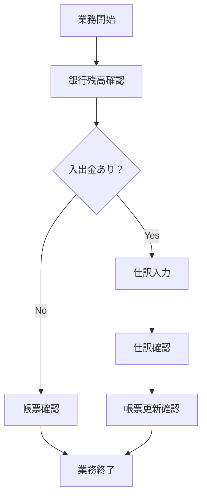
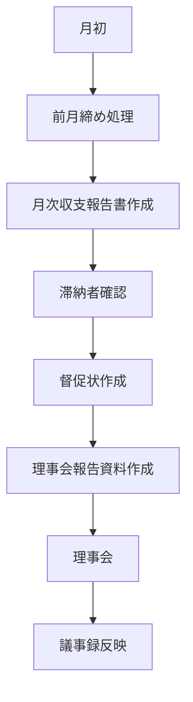
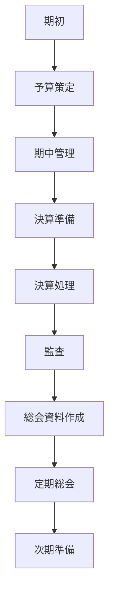
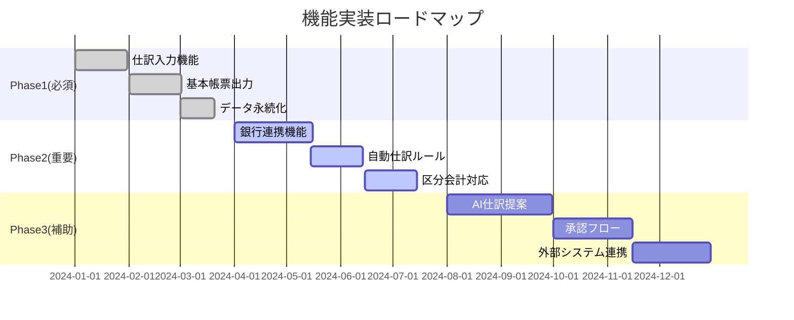
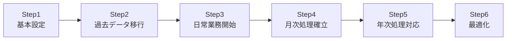

# システム利用ガイド・機能優先度

## 1. システム利用者と役割

### 1.1 主要利用者

| 利用者 | 役割 | 主な作業 | 利用頻度 |
|--------|------|----------|----------|
| **会計担当理事** | システム主担当 | 仕訳入力、帳票作成、報告書作成 | 毎日〜週次 |
| **理事長** | 承認・確認 | 報告書確認、承認 | 月次 |
| **監事** | 監査 | 帳票確認、監査 | 四半期〜年次 |
| **管理会社** | 業務支援 | データ入力補助、請求書処理 | 週次 |
| **一般組合員** | 閲覧 | 収支報告書閲覧 | 年次（総会時） |

### 1.2 利用シーン別重要度

```
◎：必須機能（システムの根幹）
○：重要機能（業務効率化に必要）
△：補助機能（あれば便利）
```

## 2. 典型的な利用シナリオ

### 2.1 日次業務フロー



**具体的な作業内容**

1. **入金処理**（頻度：高）
   - 管理費・修繕積立金の入金確認
   - 入金仕訳の作成
   - 未収金の消込

2. **支払処理**（頻度：中）
   - 請求書の確認
   - 支払仕訳の作成
   - 振込データの作成

3. **日常経費処理**（頻度：低）
   - 小口現金の管理
   - 立替経費の精算

### 2.2 月次業務フロー



**重要タスク**

| タスク | 時期 | 必要機能 | 重要度 |
|--------|------|----------|--------|
| 管理費請求 | 月初 | 請求書作成、組合員管理 | ◎ |
| 入金確認 | 5日頃 | 銀行取引取込、自動仕訳 | ◎ |
| 滞納管理 | 10日頃 | 滞納一覧、督促状 | ○ |
| 月次締め | 月末 | 試算表、収支報告書 | ◎ |
| 理事会報告 | 月末 | 各種帳票出力 | ◎ |

### 2.3 年次業務フロー



**年次重要イベント**

| イベント | 時期 | 必要な機能 | 重要度 |
|----------|------|------------|--------|
| 予算策定 | 1-2月 | 前年実績分析、予算入力 | ○ |
| 決算処理 | 3月 | 決算整理仕訳、帳票作成 | ◎ |
| 監査対応 | 4月 | 監査資料出力、証憑管理 | ◎ |
| 総会準備 | 5月 | 決算報告書、事業報告書 | ◎ |

## 3. 機能優先度マトリックス

### 3.1 重要度×緊急度マトリックス

```
        緊急度高                    緊急度低
    ┌─────────────────┬─────────────────┐
重   │【第1優先】        │【第2優先】        │
要   │◎仕訳入力         │○銀行連携         │
度   │◎帳票出力         │○自動仕訳         │
高   │◎データ保存       │○補助科目         │
    ├─────────────────┼─────────────────┤
重   │【第3優先】        │【第4優先】        │
要   │△予算管理         │△AI仕訳提案      │
度   │△承認フロー       │△外部連携        │
低   │△分析機能         │△カスタム帳票    │
    └─────────────────┴─────────────────┘
```

### 3.2 機能別重要度詳細

#### 【必須機能】（◎）システム稼働に不可欠

| 機能カテゴリ | 機能名 | 利用頻度 | 影響度 | 理由 |
|------------|--------|----------|--------|------|
| **仕訳処理** | 仕訳入力 | 毎日 | 極大 | 全ての基礎データ |
| | 仕訳一覧・検索 | 毎日 | 大 | 確認・修正に必須 |
| | 仕訳削除・修正 | 週次 | 大 | 誤り訂正に必須 |
| **基本帳票** | 試算表 | 月次 | 極大 | 残高確認の基本 |
| | 収支報告書 | 月次 | 極大 | 理事会報告に必須 |
| | 貸借対照表 | 年次 | 極大 | 決算に必須 |
| **マスター管理** | 勘定科目管理 | 初期/年次 | 大 | 仕訳の前提条件 |
| | 組合員管理 | 月次 | 大 | 請求・入金管理 |
| **データ管理** | バックアップ | 日次 | 極大 | データ保護 |
| | エクスポート | 月次 | 大 | 外部提出用 |

#### 【重要機能】（○）業務効率化に必要

| 機能カテゴリ | 機能名 | 利用頻度 | 影響度 | 理由 |
|------------|--------|----------|--------|------|
| **自動化** | 銀行取引取込 | 週次 | 大 | 入力効率化 |
| | 自動仕訳ルール | 月次 | 中 | 定型処理効率化 |
| | 繰返し仕訳 | 月次 | 中 | 定期処理効率化 |
| **区分会計** | 管理/修繕分離 | 常時 | 大 | 法的要件対応 |
| | 区分別報告書 | 月次 | 中 | 管理の透明性 |
| **補助機能** | 補助科目 | 日次 | 中 | 詳細管理 |
| | 摘要テンプレート | 日次 | 小 | 入力効率化 |
| **検索・分析** | 詳細検索 | 週次 | 中 | 問題発見 |
| | 前年比較 | 月次 | 中 | 傾向分析 |

#### 【補助機能】（△）あれば便利

| 機能カテゴリ | 機能名 | 利用頻度 | 影響度 | 理由 |
|------------|--------|----------|--------|------|
| **高度機能** | AI仕訳提案 | 日次 | 小 | 更なる効率化 |
| | 承認ワークフロー | 月次 | 小 | 内部統制強化 |
| | 予算実績管理 | 月次 | 中 | 計画管理 |
| **連携機能** | 会計ソフト連携 | 年次 | 小 | 税理士連携 |
| | クラウド同期 | 常時 | 小 | 複数端末対応 |
| **カスタマイズ** | 帳票カスタマイズ | 年次 | 小 | 個別要望対応 |
| | ダッシュボード | 日次 | 小 | 可視化向上 |

## 4. 機能実装優先順位

### 4.1 実装フェーズ



### 4.2 優先度決定基準

| 評価項目 | 重み | 説明 |
|----------|------|------|
| **業務影響度** | 40% | 機能がないと業務が停止する度合い |
| **利用頻度** | 30% | 日次/週次/月次/年次の利用回数 |
| **法的要件** | 20% | 法令遵守に必要な機能か |
| **効率改善** | 10% | 作業時間をどれだけ削減できるか |

## 5. 利用シーン別推奨機能

### 5.1 小規模マンション（50戸未満）

**必要な機能**
- 基本的な仕訳入力
- 簡易的な帳票出力
- エクセル連携

**不要な機能**
- 複雑な承認フロー
- 高度な分析機能
- マルチユーザー対応

### 5.2 中規模マンション（50-200戸）

**必要な機能**
- 完全な仕訳機能
- 銀行連携
- 区分会計
- 滞納管理

**検討すべき機能**
- 自動仕訳
- 予算管理
- 簡易承認機能

### 5.3 大規模マンション（200戸以上）

**必要な機能**
- 全機能
- 承認ワークフロー
- 詳細な分析機能
- 監査対応機能
- マルチユーザー

**追加検討機能**
- API連携
- カスタマイズ機能
- BI機能

## 6. 段階的導入アプローチ

### 6.1 導入ステップ



### 6.2 各ステップの目標と期間

| ステップ | 期間 | 主な作業 | 達成基準 |
|---------|------|----------|----------|
| **Step1** | 1週間 | マスター設定、科目設定 | テスト仕訳が入力可能 |
| **Step2** | 2週間 | 期首残高入力、過去仕訳移行 | 前期データ確認完了 |
| **Step3** | 1ヶ月 | 日次仕訳入力開始 | 1ヶ月分の仕訳完了 |
| **Step4** | 3ヶ月 | 月次締め、報告書作成 | 理事会報告完了 |
| **Step5** | 1年 | 決算処理、総会対応 | 年次決算完了 |
| **Step6** | 継続 | 運用改善、機能追加 | 効率化目標達成 |

## 7. 機能別投資対効果

### 7.1 ROI分析

| 機能 | 導入コスト | 削減時間/月 | 投資回収期間 | 優先度 |
|------|-----------|------------|-------------|--------|
| **仕訳入力** | 低 | 20時間 | 即効 | ◎ |
| **銀行連携** | 中 | 10時間 | 3ヶ月 | ○ |
| **自動仕訳** | 中 | 5時間 | 6ヶ月 | ○ |
| **AI提案** | 高 | 3時間 | 12ヶ月 | △ |
| **承認フロー** | 高 | 2時間 | 18ヶ月 | △ |

### 7.2 定性的効果

| 機能カテゴリ | 定性的効果 | 重要度 |
|------------|-----------|--------|
| **データ整合性** | ミス削減、信頼性向上 | 極高 |
| **透明性向上** | 組合員への説明責任 | 高 |
| **業務標準化** | 引継ぎ容易化 | 高 |
| **監査対応** | 監査効率化 | 中 |
| **分析機能** | 意思決定支援 | 中 |

## 8. リスクと対策

### 8.1 機能不足によるリスク

| リスク | 影響度 | 発生確率 | 必要な機能 | 対策 |
|--------|--------|----------|-----------|------|
| **データ消失** | 極大 | 低 | バックアップ | 自動バックアップ必須 |
| **不正確な帳票** | 大 | 中 | 検証機能 | 貸借一致チェック必須 |
| **法令違反** | 大 | 低 | 区分会計 | 区分別管理必須 |
| **業務停滞** | 中 | 中 | 基本機能 | 最小機能セット確保 |

### 8.2 段階的リスク軽減

```
Phase1: 基本リスク対策（データ保護、基本検証）
  ↓
Phase2: 業務リスク対策（効率化、自動化）
  ↓
Phase3: 統制リスク対策（承認、監査証跡）
  ↓
Phase4: 戦略リスク対策（分析、予測）
```

## 9. 成功指標（KPI）

### 9.1 定量指標

| 指標 | 現状 | 目標 | 測定方法 |
|------|------|------|----------|
| **月次締め時間** | 40時間 | 10時間 | 作業時間記録 |
| **仕訳入力時間** | 5分/件 | 2分/件 | システムログ |
| **エラー発生率** | 5% | 1%未満 | エラーログ |
| **帳票作成時間** | 8時間 | 1時間 | 作業時間記録 |

### 9.2 定性指標

| 指標 | 評価方法 | 目標水準 |
|------|----------|----------|
| **利用者満足度** | アンケート | 80%以上 |
| **データ信頼性** | 監査指摘数 | 0件 |
| **業務継続性** | 引継ぎ期間 | 1週間以内 |
| **法令遵守度** | コンプライアンスチェック | 100% |

## 10. まとめ

### 10.1 導入推奨プラン

**小規模マンション向け**
```
必須機能のみ → 3ヶ月で運用開始 → 段階的に機能追加
```

**中規模マンション向け**
```
必須＋重要機能 → 6ヶ月で本格運用 → 年次で評価・改善
```

**大規模マンション向け**
```
フル機能導入 → 1年かけて段階導入 → 継続的な最適化
```

### 10.2 次のアクション

1. **現状分析** - 現在の業務フローと課題を整理
2. **要件定義** - 必要な機能を優先度付けして選定
3. **導入計画** - 段階的な導入スケジュール策定
4. **体制構築** - 運用体制と役割分担を決定
5. **導入開始** - 基本機能から順次導入

---

*最終更新日: 2025-08-18*
*バージョン: 1.0.0*