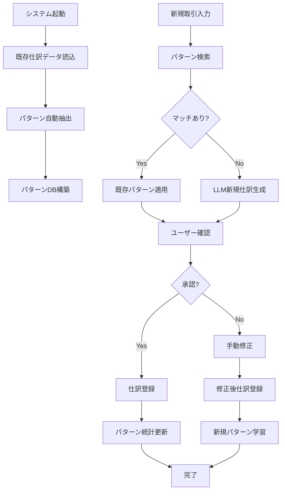

# 既存仕訳データ活用システム - 実装例

## 概要

`/src/domain/services`の既存データから仕訳パターンを自動抽出し、LLMプロンプトに組み込む機能を実装しました。

## 実装した機能

### 1. JournalPatternService
既存の仕訳データからパターンを抽出し、学習機能を提供

#### 主な機能：
- **パターン自動抽出**: 既存仕訳を分析してパターン化
- **類似度計算**: キーワード、金額範囲、正規表現でマッチング
- **学習機能**: ユーザー承認により新規パターンを学習
- **統計管理**: 使用頻度、成功率の追跡

### 2. LLMJournalService  
LLMプロンプトを生成し、仕訳提案を行う

#### 主な機能：
- **プロンプト生成**: 既存パターンを含む詳細なプロンプト作成
- **データ正規化**: 任意形式→標準JSON変換
- **仕訳生成**: パターンマッチング + 新規仕訳作成

## 使用例

### 既存仕訳からのパターン抽出

```typescript
// サービス初期化時に自動実行
const patternService = new JournalPatternService(
  journalService,
  accountService, 
  auxiliaryService
);

// 既存仕訳から自動でパターンを抽出
// 例：「清掃業務費（1月分）」「清掃業務費（2月分）」 
//   → 「清掃業務費パターン」として登録
```

### LLMプロンプトの生成例

実際に生成されるプロンプト：

```
あなたはマンション管理組合の会計専門家です。
以下の取引データから適切な仕訳を生成してください。

【使用可能な勘定科目】
1112:普通預金
4111:管理費収入
4112:修繕積立金収入
5121:清掃費
...

【過去の仕訳パターン（30件）】
◆ パターンID: pattern_001
  キーワード: 清掃, 業務費
  仕訳: 借方:5121:清掃費 貸方:1112:普通預金
  使用回数: 12回
  成功率: 95%
  摘要例: 清掃業務費（1月分）, 清掃業務費（2月分）

◆ パターンID: pattern_002  
  キーワード: 管理費, ヤマダ
  仕訳: 借方:1112:普通預金 貸方:4111:管理費収入
  使用回数: 8回
  成功率: 100%
  摘要例: 管理費　ヤマダタロウ, 1月分管理費（101号室）

【区分所有者リスト】
101号室 山田太郎
102号室 佐藤花子
...

【仕訳生成ルール】
1. まず過去の仕訳パターンから類似するものを検索
2. 類似パターン（similarity >= 70）がある場合は、そのパターンを適用
3. 類似パターンがない場合は、新規仕訳として生成
4. 新規パターンの場合は isNewPattern: true を設定

【対象取引】
日付: 2024-01-15
摘要: 清掃業務委託費 1月分
金額: -50000円
支払先: ○○清掃サービス

上記取引の仕訳を生成してください。
```

### パターンマッチングの動作例

```typescript
// 新しい取引に対する処理
const transaction = {
  date: "2024-01-15",
  description: "清掃業務委託費 2月分", 
  amount: -52000
};

// パターン検索
const matchedPatterns = patternService.findSimilarPatterns(
  transaction.description,
  Math.abs(transaction.amount),
  70 // 70%以上の類似度
);

// 結果例：
// [
//   {
//     pattern: { id: 'pattern_001', keywords: ['清掃', '業務費'] },
//     similarity: 92,
//     matchedFields: ['keywords: 清掃, 業務費', 'amount: 52000 (48000-60000)'],
//     confidence: 92
//   }
// ]
```

### 学習機能の例

```typescript
// ユーザーが仕訳を承認した場合
patternService.learnFromUserApproval(
  'tx_001',                    // 取引ID
  '自販機売上回収',            // 摘要
  15230,                       // 金額
  {                            // 適用された仕訳
    debitAccount: '1112',      // 普通預金
    creditAccount: '4191'      // 雑収入
  },
  undefined,                   // パターンID（新規の場合はundefined）
  false                        // ユーザー修正の有無
);

// 同様の取引が2回以上発生すると自動で新規パターンを作成：
// パターン名: "学習パターン：自販機・売上"
// キーワード: ["自販機", "売上", "回収"]
// 仕訳ルール: 借方:普通預金 / 貸方:雑収入
```

## データ構造

### JournalPattern
```typescript
{
  id: "pattern_001",
  name: "清掃業務費パターン", 
  keywords: ["清掃", "業務費"],
  conditions: {
    amountRange: { min: 40000, max: 60000 },
    descriptionPattern: "清掃.*業務.*費"
  },
  journalRule: {
    debitAccount: "5121",
    creditAccount: "1112"
  },
  statistics: {
    usageCount: 12,
    successRate: 95.8,
    lastUsed: "2024-01-15"
  }
}
```

### LLMプロンプト用データ
```typescript
{
  patternId: "pattern_001",
  keywords: ["清掃", "業務費"],
  description: "清掃業務費パターン",
  entries: [
    {
      debit: { account: "5121", accountName: "清掃費" },
      credit: { account: "1112", accountName: "普通預金" }
    }
  ],
  frequency: 12,
  successRate: 95.8,
  examples: ["清掃業務費（1月分）", "清掃業務費（2月分）"]
}
```

## 処理フロー



## メリット

### 1. **学習効果**
- 使用するほど精度が向上
- 組織固有のパターンを自動学習

### 2. **効率性**  
- 同じパターンの取引は自動処理
- 手作業の大幅削減

### 3. **透明性**
- マッチング理由を明示
- パターンの統計情報を追跡

### 4. **柔軟性**
- 新しい取引パターンに自動対応
- ルールの動的更新

## 実装のポイント

### 1. **既存データの活用**
```typescript
// SampleDataServiceで生成された仕訳を分析
private extractPatternsFromExistingJournals() {
  const journals = this.journalService.getJournals();
  // 摘要の類似性でグループ化
  // 各グループからパターンを生成
}
```

### 2. **正規化処理**
```typescript  
// 摘要の正規化（数字、日付を汎用化）
private normalizeDescription(description: string): string {
  return description
    .replace(/\d{4}年\d{1,2}月/g, 'YYYY年MM月')
    .replace(/\d{1,2}月分/g, 'MM月分')
    .replace(/\d+円/g, '金額円')
    .replace(/\d+号室/g, 'XX号室');
}
```

### 3. **類似度計算**
```typescript
private calculatePatternSimilarity(
  description: string,
  amount: number,
  pattern: JournalPattern
): number {
  let score = 0;
  
  // キーワードマッチング (50%)
  // 金額範囲チェック (30%)  
  // 正規表現マッチング (20%)
  
  return Math.min(score, 100);
}
```

この実装により、既存の仕訳データを最大限活用し、組織固有の会計パターンを学習するシステムが完成しました。