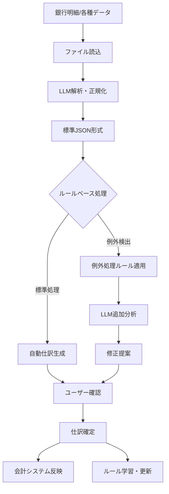

# マンション管理組合会計システム - マスターデータ管理と自動仕訳システム設計書

## 1. システム概要

### 1.1 目的
クラセルの機能を参考に、マンション管理組合の会計業務を効率化するためのマスターデータ管理機能と自動仕訳システムを構築する。

### 1.2 主要機能
1. **マスターデータ管理強化**
   - 区分所有者詳細管理
   - 共用施設契約管理
   - 業者・発注先管理

2. **自動化エンジン**
   - ルールベース自動仕訳
   - 銀行明細CSVインポート
   - LLM連携による仕訳提案

## 2. アーキテクチャ設計

### 2.1 システム構成図
```
┌─────────────────────────────────────────────────────────┐
│                    フロントエンド (React)                    │
├─────────────────────────────────────────────────────────┤
│                  ビジネスロジック層                          │
│  ┌────────────┐ ┌────────────┐ ┌────────────────┐      │
│  │マスターデータ│ │自動仕訳    │ │LLM連携         │      │
│  │管理サービス  │ │エンジン    │ │サービス        │      │
│  └────────────┘ └────────────┘ └────────────────┘      │
├─────────────────────────────────────────────────────────┤
│                  データアクセス層                            │
│  ┌────────────┐ ┌────────────┐ ┌────────────────┐      │
│  │LocalStorage │ │CSV Parser  │ │外部API         │      │
│  │永続化       │ │            │ │インターフェース │      │
│  └────────────┘ └────────────┘ └────────────────┘      │
└─────────────────────────────────────────────────────────┘
```

### 2.2 データフロー
```
銀行明細CSV → インポート → 自動仕訳エンジン → LLM提案 → 確認・修正 → 仕訳登録
                              ↑
                        ルールデータベース
```

## 3. マスターデータ管理機能詳細設計

### 3.1 区分所有者管理 (UnitOwnerDetail)

#### 3.1.1 データ構造
```typescript
interface UnitOwnerDetail {
  // 基本情報
  id: string                    // システム内部ID
  unitNumber: string            // 部屋番号 (例: "101", "202")
  
  // 所有者情報
  ownerInfo: {
    name: string              // 氏名
    nameKana: string          // カナ
    postalCode: string        // 郵便番号
    address: string           // 住所
    phone: string             // 電話番号
    mobile: string            // 携帯電話
    email: string             // メールアドレス
    emergencyContact: string  // 緊急連絡先名
    emergencyPhone: string    // 緊急連絡先電話
  }
  
  // 居住者情報（所有者と異なる場合）
  residentInfo?: {
    name: string
    relationship: string      // 所有者との関係
    phone: string
  }
  
  // 口座情報
  bankAccount: {
    bankName: string          // 銀行名
    branchName: string        // 支店名
    accountType: '普通' | '当座'
    accountNumber: string     // 口座番号
    accountHolder: string     // 口座名義
  }
  
  // 請求情報
  fees: {
    managementFee: number     // 管理費
    reserveFund: number       // 修繕積立金
    parkingFee?: number       // 駐車場代
    bicycleParkingFee?: number // 駐輪場代
    otherFees?: Array<{       // その他費用
      name: string
      amount: number
    }>
  }
  
  // ステータス
  status: {
    isActive: boolean         // 有効/無効
    moveInDate: string        // 入居日
    moveOutDate?: string      // 退去日
    remarks: string           // 備考
  }
  
  // 支払履歴
  paymentHistory: {
    lastPaymentDate: string   // 最終支払日
    unpaidAmount: number      // 未収金額
    prepaidAmount: number     // 前受金額
  }
}
```

#### 3.1.2 機能一覧
- CRUD操作（作成・読取・更新・削除）
- 部屋番号による検索
- 月次請求額の自動計算
- 未収金・前受金の管理
- 所有者変更履歴の記録

### 3.2 共用施設管理 (FacilityContract)

#### 3.2.1 データ構造
```typescript
interface FacilityContract {
  id: string
  facilityType: 'parking' | 'bicycleParking' | 'storageRoom' | 'other'
  facilityNumber: string      // 区画番号 (例: "P-01", "B-12")
  
  contractInfo: {
    unitNumber?: string       // 契約部屋番号
    contractorName?: string   // 契約者名
    startDate: string         // 契約開始日
    endDate?: string          // 契約終了日
    monthlyFee: number        // 月額料金
    status: 'vacant' | 'occupied' | 'reserved' | 'maintenance'
  }
  
  location: {
    floor: string             // 階数
    area: string              // エリア
    size: string              // サイズ
  }
  
  nextAvailableDate?: string  // 次回利用可能日
  remarks: string             // 備考
}
```

#### 3.2.2 機能一覧
- 施設区画の登録・管理
- 空き状況の可視化
- 契約状態の管理
- 利用料金の自動集計

### 3.3 業者管理 (VendorDetail)

#### 3.3.1 データ構造
```typescript
interface VendorDetail {
  id: string
  
  vendorInfo: {
    name: string              // 業者名
    registrationNumber: string // 法人番号
    representativeName: string // 代表者名
    address: string           // 住所
    phone: string             // 電話番号
    email: string             // メール
  }
  
  bankAccount: {
    // 振込先情報
  }
  
  contractInfo: {
    contractType: 'regular' | 'spot' | 'annual'
    serviceCategory: string   // サービスカテゴリ
    paymentSchedule: 'monthly' | 'quarterly' | 'annual' | 'ondemand'
    standardAmount: number    // 標準金額
  }
  
  documents: Array<{          // 関連書類
    documentType: 'contract' | 'invoice' | 'quote'
    fileName: string
    uploadDate: string
  }>
  
  paymentHistory: Array<{     // 支払履歴
    date: string
    amount: number
    description: string
  }>
}
```

## 4. 自動仕訳エンジン詳細設計（LLMファーストアプローチ）

### 4.1 処理フロー



### 4.1.1 LLMファースト変換フロー

1. **入力データの多様性対応**
   - CSV、Excel、PDF、画像、テキストファイル等
   - 各銀行独自のフォーマット
   - 手書き明細のスキャンデータ

2. **LLMによる正規化処理**
   - フォーマット自動認識
   - データ抽出と構造化
   - 標準JSON形式への変換

3. **ルールベース例外処理**
   - 変換後のデータ検証
   - 業務ルールに基づく補正
   - エラー検出と修正提案

### 4.2 自動仕訳ルール (AutoJournalRule)

#### 4.2.1 データ構造
```typescript
interface AutoJournalRule {
  id: string
  ruleName: string            // ルール名
  priority: number            // 優先順位 (1が最高)
  
  conditions: {               // マッチング条件
    transactionType?: 'income' | 'expense'
    amountRange?: {
      min?: number
      max?: number
    }
    descriptionPatterns?: string[]  // キーワード配列
    vendorName?: string
    datePattern?: {
      dayOfMonth?: number[]   // 特定日 (例: [10, 25])
      monthlyRecurring?: boolean
    }
  }
  
  actions: {                  // 実行アクション
    debitAccount: string      // 借方科目
    creditAccount: string     // 貸方科目
    division?: string         // 区分
    auxiliaryCode?: string    // 補助科目
    description?: string      // 摘要
  }
  
  metadata: {
    isActive: boolean
    createdAt: string
    usageCount: number        // 使用回数
    lastUsedAt?: string
    successRate?: number      // 成功率
  }
}
```

#### 4.2.2 ルールマッチングアルゴリズム
```typescript
function matchRule(transaction: BankTransaction, rules: AutoJournalRule[]): AutoJournalRule | null {
  // 1. アクティブなルールを優先順位でソート
  const activeRules = rules
    .filter(r => r.metadata.isActive)
    .sort((a, b) => a.priority - b.priority)
  
  // 2. 各ルールに対してマッチング判定
  for (const rule of activeRules) {
    if (matchesAllConditions(transaction, rule.conditions)) {
      return rule
    }
  }
  
  return null
}
```

### 4.3 汎用データインポート（LLMベース）

#### 4.3.1 対応可能な入力形式
- **構造化データ**: CSV、Excel、TSV、JSON
- **半構造化データ**: PDF（表形式）、HTML
- **非構造化データ**: テキストファイル、画像（OCR経由）
- **銀行別対応**: 形式を問わず全銀行対応可能

#### 4.3.2 標準化JSON形式
```typescript
// LLMが出力する標準形式
interface StandardizedBankTransaction {
  transactions: Array<{
    date: string              // YYYY-MM-DD形式
    time?: string             // HH:mm:ss形式
    description: string       // 取引内容
    amount: number           // 金額（入金は正、出金は負）
    balance?: number         // 残高
    category?: string        // LLMが推定したカテゴリ
    payee?: string          // 支払先/受取先
    referenceNumber?: string // 取引番号
    notes?: string          // 補足情報
    confidence: number      // 0-100の信頼度スコア
  }>
  metadata: {
    bankName?: string       // LLMが推定した銀行名
    accountNumber?: string  // 口座番号（マスキング済）
    period?: {
      from: string
      to: string
    }
    importedAt: string
    originalFormat: string  // 元のファイル形式
  }
}
```

#### 4.3.3 LLM変換プロンプト
```typescript
interface LLMConversionPrompt {
  systemPrompt: string   // 変換ルールと出力形式の指示
  userPrompt: {
    rawData: string      // 元データ（テキスト化済）
    hints?: {            // ヒント情報（オプション）
      bankName?: string
      expectedFormat?: string
      dateRange?: string
    }
  }
  outputFormat: 'json'   // 必ずJSON形式で返却
  validationRules: Array<string> // 検証ルール
}
```

## 5. LLM連携機能詳細設計

### 5.1 二段階LLM処理フロー

```
【第1段階：データ正規化】
1. 入力データの読み込み（任意形式）
2. LLMによるフォーマット認識
3. 標準JSON形式への変換
4. 基本的な検証とクレンジング

【第2段階：仕訳生成】
5. 標準化データのルールマッチング
6. 例外・未マッチ項目の抽出
7. コンテキスト情報の付与
8. LLMによる仕訳提案生成
9. 信頼度評価と確認
```

### 5.2 データ正規化プロンプト設計

```typescript
// 第1段階：データ正規化用プロンプト
interface DataNormalizationPrompt {
  systemPrompt: `
    あなたは銀行取引明細を解析する専門家です。
    以下のデータを分析し、標準JSON形式に変換してください。
    
    【出力形式】
    - 日付: YYYY-MM-DD形式
    - 金額: 入金は正の数、出金は負の数
    - 各取引の信頼度を0-100で評価
    
    【注意事項】
    - 日付が不明な場合は null
    - 金額が不明な場合はスキップ
    - 摘要は可能な限り原文を保持
  `
  
  userPrompt: string          // 生データ
  expectedOutput: 'StandardizedBankTransaction'
}

// 第2段階：仕訳生成用プロンプト（既存仕訳学習型）
interface JournalGenerationPrompt {
  systemPrompt: `
    あなたはマンション管理組合の会計専門家です。
    以下の取引データから適切な仕訳を生成してください。
    
    【使用可能な勘定科目】
    ${accountChartList}
    
    【過去の仕訳パターン】
    ${existingJournalPatterns}
    
    【仕訳ルール】
    1. まず過去の仕訳パターンから類似するものを探してください
    2. 類似パターンがある場合は、それを参考に仕訳を生成
    3. 類似パターンがない場合は、新規仕訳として以下を考慮：
       - 収入は「普通預金/該当収入科目」
       - 支出は「該当費用科目/普通預金」
       - 不明な場合は「仮払金」「仮受金」を使用
    4. 新規パターンの場合は isNewPattern: true を設定
  `
  
  transaction: StandardizedBankTransaction
  context: {
    // 既存の仕訳データベース
    existingJournals: Array<{
      id: string
      date: string
      description: string
      amount: number
      debit: {
        account: string
        accountName: string
      }
      credit: {
        account: string
        accountName: string
      }
      keywords: string[]        // 検索用キーワード
      frequency: number         // 使用頻度
      lastUsed: string         // 最終使用日
    }>
    
    // マスターデータ
    unitOwners: Array<{
      unitNumber: string
      name: string
      monthlyFees: {
        management: number
        reserve: number
      }
    }>
    
    vendors: Array<{
      name: string
      category: string
      regularAmount?: number
    }>
    
    // 類似度計算用の設定
    similarityThreshold: number  // 類似度閾値（0-100）
  }
}
```

### 5.3 例外処理ルールエンジン

```typescript
// ルールベースの例外処理
interface ExceptionRule {
  id: string
  name: string
  priority: number
  
  // 検出条件
  detection: {
    patterns: Array<{
      field: 'amount' | 'description' | 'date' | 'balance'
      operator: 'equals' | 'contains' | 'regex' | 'range'
      value: any
    }>
    logic: 'AND' | 'OR'
  }
  
  // 処理アクション
  action: {
    type: 'correct' | 'flag' | 'reject' | 'requestLLM'
    correction?: {
      field: string
      value: any
    }
    message?: string
    requiresApproval: boolean
  }
}

// 例外処理の実例
const exceptionRules: ExceptionRule[] = [
  {
    id: 'rule001',
    name: '負の残高検出',
    priority: 1,
    detection: {
      patterns: [{
        field: 'balance',
        operator: 'range',
        value: { max: 0 }
      }],
      logic: 'AND'
    },
    action: {
      type: 'flag',
      message: '残高が負になっています。確認が必要です。',
      requiresApproval: true
    }
  },
  {
    id: 'rule002',
    name: '重複取引検出',
    priority: 2,
    detection: {
      patterns: [{
        field: 'description',
        operator: 'equals',
        value: '{{previous.description}}'
      }],
      logic: 'AND'
    },
    action: {
      type: 'requestLLM',
      message: '重複の可能性があります。LLMで確認します。',
      requiresApproval: false
    }
  }
]
```

## 6. UI/UXフロー設計

### 6.1 画面構成

#### 6.1.1 マスターデータ管理画面
```
[タブメニュー]
├── 区分所有者管理
│   ├── 一覧表示（グリッド）
│   ├── 詳細編集フォーム
│   └── 請求額プレビュー
├── 共用施設管理
│   ├── 空き状況ビュー（ビジュアル）
│   ├── 契約管理
│   └── 利用料集計
└── 業者管理
    ├── 業者一覧
    ├── 契約情報
    └── 支払履歴
```

#### 6.1.2 自動仕訳画面（LLMファースト）
```
[ワークフロー画面]
├── Step1: データインポート
│   ├── ファイル選択（ドラッグ&ドロップ対応）
│   ├── ファイル形式自動判定
│   └── LLM正規化処理
│       ├── 処理中インジケーター
│       └── 変換結果プレビュー
├── Step2: データ検証
│   ├── 正規化済みデータ表示
│   ├── 例外検出結果
│   │   ├── エラー項目（赤）
│   │   ├── 警告項目（黄）
│   │   └── 確認済み（緑）
│   └── 手動修正機能
├── Step3: 仕訳生成
│   ├── ルールベース自動仕訳
│   ├── LLM仕訳提案
│   │   ├── 信頼度表示
│   │   └── 提案理由表示
│   └── 手動仕訳作成
└── Step4: 確定処理
    ├── 最終確認画面
    ├── 承認フロー
    └── 仕訳登録実行
```

### 6.2 ユーザビリティ要件

1. **直感的な操作性**
   - ドラッグ&ドロップでのCSVアップロード
   - ワンクリックでの一括処理
   - キーボードショートカット対応

2. **視覚的フィードバック**
   - 処理状況のプログレスバー
   - 成功/エラーのトースト通知
   - カラーコーディング

3. **エラーハンドリング**
   - バリデーションメッセージ
   - ロールバック機能
   - エラーログ出力

## 7. データベース設計

### 7.1 データ永続化戦略

現段階では**LocalStorage**を使用し、将来的にバックエンドAPI実装時に移行可能な設計とする。

#### 7.1.1 ストレージ構造
```javascript
localStorage: {
  'masterData': {
    unitOwners: Map<string, UnitOwnerDetail>
    facilities: Map<string, FacilityContract>
    vendors: Map<string, VendorDetail>
  },
  'autoJournalRules': Map<string, AutoJournalRule>,
  'bankTransactions': Map<string, BankTransaction>,
  'journalSuggestions': Map<string, JournalSuggestion>
}
```

### 7.2 データ整合性

1. **トランザクション管理**
   - 更新前のバックアップ
   - 原子性の保証
   - ロールバック機能

2. **参照整合性**
   - 外部キー相当のチェック
   - カスケード削除の制御

## 8. セキュリティ考慮事項

### 8.1 データ保護
- 個人情報のマスキング表示
- 銀行口座情報の暗号化（将来実装）
- セッションタイムアウト

### 8.2 アクセス制御
- ユーザー権限管理（将来実装）
- 監査ログ（将来実装）

## 9. パフォーマンス要件

### 9.1 応答時間
- CSV読込: 1000件/秒以上
- ルールマッチング: 100件/秒以上
- LLM応答: 5秒以内

### 9.2 データ容量
- 区分所有者: 最大1000件
- 取引データ: 最大10万件/年
- ルール: 最大500件

## 10. 実装計画

### Phase 1: 基盤構築（1週間）
- [ ] 型定義の実装
- [ ] マスターデータサービスの実装
- [ ] 基本的なCRUD機能

### Phase 2: 自動仕訳エンジン（1週間）
- [ ] ルールエンジンの実装
- [ ] CSVパーサーの実装
- [ ] マッチングアルゴリズム

### Phase 3: UI実装（2週間）
- [ ] マスターデータ管理画面
- [ ] 自動仕訳ワークフロー画面
- [ ] レポート画面

### Phase 4: LLM連携（1週間）
- [ ] API連携実装
- [ ] プロンプトエンジニアリング
- [ ] レスポンス処理

### Phase 5: テスト・改善（1週間）
- [ ] 単体テスト
- [ ] 統合テスト
- [ ] パフォーマンスチューニング

## 11. 技術スタック

### 11.1 追加ライブラリ
```json
{
  "dependencies": {
    // 既存
    "react": "^18.3.1",
    "react-dom": "^18.3.1",
    "xlsx": "^0.18.5",
    
    // 追加予定
    "papaparse": "^5.4.1",      // CSV解析
    "date-fns": "^2.30.0",       // 日付処理
    "react-dropzone": "^14.2.3", // ファイルアップロード
    "recharts": "^2.10.0",       // グラフ表示
    "react-hook-form": "^7.48.0", // フォーム管理
    "zod": "^3.22.4"             // バリデーション
  }
}
```

### 11.2 ディレクトリ構造
```
src/
├── domain/
│   ├── services/
│   │   ├── MasterDataService.ts
│   │   ├── AutoJournalService.ts
│   │   ├── BankImportService.ts
│   │   └── LLMService.ts
│   └── rules/
│       └── JournalRuleEngine.ts
├── types/
│   ├── master.ts
│   ├── autoJournal.ts
│   └── llm.ts
├── ui/
│   ├── master/
│   │   ├── UnitOwnerManager.tsx
│   │   ├── FacilityManager.tsx
│   │   └── VendorManager.tsx
│   └── autoJournal/
│       ├── CSVImporter.tsx
│       ├── JournalMatcher.tsx
│       └── JournalConfirm.tsx
└── utils/
    ├── csvParser.ts
    ├── validators.ts
    └── formatters.ts
```

## 12. 今後の拡張計画

### 12.1 短期（3ヶ月）
- モバイル対応
- Excel出力機能
- 通知機能

### 12.2 中期（6ヶ月）
- バックエンドAPI実装
- マルチテナント対応
- 承認ワークフロー

### 12.3 長期（1年）
- 銀行API直接連携
- 収納代行サービス連携
- AI予測分析